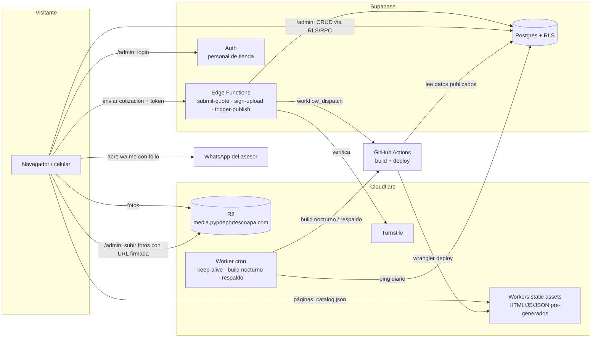
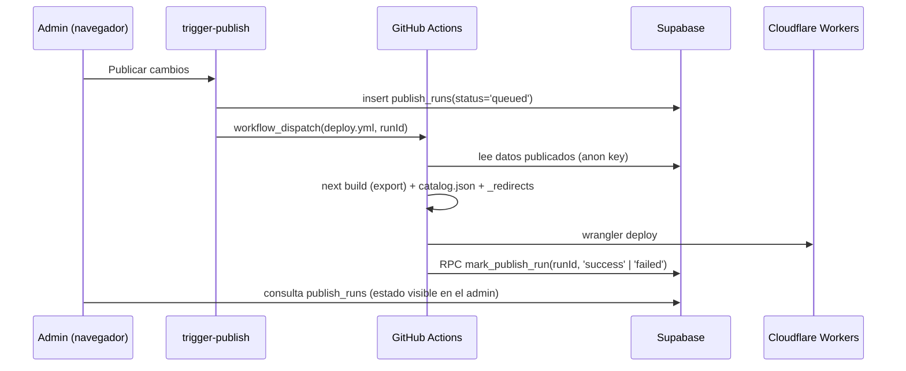

# 02 · TRD — Requerimientos técnicos

> **Documento para construir.** Define el *cómo*: arquitectura, stack, contratos y reglas técnicas. El *qué* está en `01-PRD.md`; el modelo de datos detallado en `05-BACKEND-SCHEMA.md`.
>
> | Campo | Valor |
> |---|---|
> | Versión | 0.3 |
> | Fecha | 1-oct-2026 |
> | Límites de planes verificados | 29-sep-2026 (ver §4 y §22). **Revisar antes de salir a producción.** |
>
> **Cambios 0.2 → 0.3 (al escribir el esquema y los flujos):** todo producto tiene al menos una variante, así que `variantId` nunca es nulo (§6.3) · Edge Function `invite-staff` y secreto `IP_HASH_SALT` (§9) · espacio de foto `advisor` (§6.2) · evento `begin_quote_form` (§12).
>
> **Cambios 0.1 → 0.2 (tras el diseño de pantallas):** ADR-10 las fotos son contenido (`site_media`, §6.2) · recorte 4:5 al subir · rutas ajustadas (sin `/nosotros`, con `not-found`) · sugerencia "¿Quisiste decir…?" y órdenes del listado (§7) · aviso de agregado en lugar de toast (§6.3) · estados de carga y vacío (§6.6) · íconos Lucide y simple-icons · carpeta `design/` en el repositorio.

---

## 1. Decisiones clave (ADR resumido)

| # | Decisión | Por qué | Alternativa descartada |
|---|---|---|---|
| ADR-1 | **Next.js 16 con `output: 'export'` (sitio estático)** en modo catálogo | $0, carga instantánea, resiste caídas de la BD (NFR-9), SEO perfecto | SSR en Workers: el plan gratuito limita a **10 ms de CPU por petición**, insuficiente para renderizar Next.js en servidor de forma confiable |
| ADR-2 | **Cloudflare Workers (static assets)** para hospedar | Peticiones a archivos estáticos **gratis e ilimitadas**; uso comercial permitido; DNS, cron, R2 y Turnstile en la misma cuenta | Vercel Hobby: **solo uso personal, no comercial** |
| ADR-3 | **Supabase (Free)** para Postgres, Auth, RLS y Edge Functions | Postgres real con esquema de comercio desde el día 1; auth y seguridad por fila incluidos | Medusa (requiere servidor propio, no gratis) · Firebase (NoSQL, peor para comercio) |
| ADR-4 | **Cloudflare R2** para imágenes | 10 GB gratis y **egreso gratis**; Supabase Storage solo da 5 GB de egreso y **no transforma imágenes** en Free | Supabase Storage |
| ADR-5 | **Imágenes redimensionadas en el navegador** al subirlas (WebP en 4 anchos) | Sin costo de transformación; el sitio estático sirve el tamaño correcto | Servicio de optimización (de pago) |
| ADR-6 | **Publicación por reconstrucción**: el admin guarda en la BD y "Publicar cambios" dispara un build | Mantiene el sitio 100 % estático; el cambio tarda ~2–4 min en verse | Leer la BD en cada visita |
| ADR-7 | **Lógica de escritura pública en Edge Functions** (enviar cotización) y de administración vía RLS + RPC | La BD nunca se expone sin reglas; Turnstile se valida en servidor | Insertar directo desde el navegador |
| ADR-8 | **Tareas programadas con Cron Triggers de Cloudflare** | Evitan la pausa de Supabase y disparan builds/respaldos; los cron de GitHub Actions se desactivan tras 60 días sin actividad en el repo y pueden retrasarse | Cron de GitHub Actions |
| ADR-10 | **Las fotos son contenido, no parte del front.** Ninguna foto vive en el repositorio: productos, galería y fotos del sitio (portada, muestras, tienda) se suben desde el admin a R2 y el sitio solo recibe su URL | El personal cambia fotos sin tocar código ni esperar a un desarrollador; el repositorio se mantiene ligero | Fotos en `public/` |
| ADR-9 | **Camino a e-commerce = mismo código Next.js en modo SSR** (OpenNext en Workers Paid, ~US$5/mes) | Se cambia el modo de despliegue, no la app | Reescribir en una plataforma de e-commerce |

## 2. Arquitectura — modo catálogo (v1)



**Idea central:** el sitio público es un conjunto de archivos generados en el build a partir de la BD. Lo único dinámico en tiempo de visita es: la lista de cotización (en el navegador), la búsqueda y filtros (en el navegador, sobre `catalog.json`) y el envío de la cotización (Edge Function).

## 3. Stack y versiones

| Capa | Tecnología | Versión objetivo | Notas |
|---|---|---|---|
| Runtime de build | Node.js | 24 LTS | `.nvmrc` |
| Gestor de paquetes | pnpm | 10.x | |
| Framework | Next.js (App Router) | 16.x | `output: 'export'`, `trailingSlash: false` |
| UI | React | 19.x | |
| Lenguaje | TypeScript | 5.x, `strict: true` | Fijado en `~5.9` (TypeScript 7 aún no se adopta) |
| Estilos | Tailwind CSS | 4.x | Tokens de marca en `@theme` (ver `03-UI-UX.md`) |
| Componentes admin | shadcn/ui + Radix | última | Solo en `/admin`; el sitio público usa componentes propios de marca |
| Tipografía | Barlow + Barlow Condensed | vía `next/font/google` (autoalojadas en build) | |
| Estado del cliente | Zustand + `persist` | 5.x | Lista de cotización y datos del solicitante |
| Formularios | React Hook Form + Zod | última | Esquemas Zod compartidos con Edge Functions |
| Búsqueda | MiniSearch | 7.x | Índice construido en el navegador desde `catalog.json`; `autoSuggest` para "¿Quisiste decir…?" |
| Íconos | lucide-react · simple-icons (solo el glifo de WhatsApp) | última | Trazo 2 px, 20/24 px (`03-UI-UX.md` §5) |
| CSV/Excel | Papa Parse · SheetJS (`xlsx`) | última | Importador del admin |
| Imágenes (subida) | `browser-image-compression` o Canvas API | — | Genera WebP 320/640/1024/1600 |
| Backend | Supabase (Postgres 15+, Auth, Edge Functions en Deno) | CLI última | Migraciones en `supabase/migrations` |
| Almacenamiento | Cloudflare R2 (API S3) | — | Firma con `aws4fetch` en la Edge Function |
| Anti-spam | Cloudflare Turnstile | — | Modo "managed", invisible cuando se puede |
| Hosting | Cloudflare Workers + static assets | Wrangler 4.x | `_redirects` y `_headers` soportados |
| Analítica | Google Analytics 4 detrás de `track()` | — | Nombres de eventos de e-commerce estándar |
| Pruebas | Vitest · Testing Library · Playwright · pgTAP (`supabase test db`) | última | Playwright sirve `apps/web/out` con `serve` |
| Calidad | ESLint · Prettier · `tsc --noEmit` | ESLint 9 | Un solo `eslint.config.mjs` en la raíz con `eslint-config-next` y `eslint-config-prettier` |
| Entorno local | `.venv` (Python) con `nodeenv` | — | Node 24 y pnpm aislados dentro del proyecto; ver `README.md` |
| CI/CD | GitHub Actions | | Repo privado |

## 4. Planes gratuitos: límites y consumo esperado

| Servicio | Límite Free relevante | Consumo estimado v1 | Riesgo / mitigación |
|---|---|---|---|
| **Cloudflare Workers** | Static assets **gratis e ilimitados**; scripts: 100 000 req/día, 10 ms CPU, 5 cron triggers, bundle 64 MiB (desde 4-sep-2026) | Sitio 100 % estático → 0 req de script; 1 worker cron | Ninguno relevante en modo catálogo |
| **Cloudflare R2** | 10 GB-mes, 1 M ops clase A, 10 M clase B, **egreso gratis** | 500 productos × 4 fotos × 4 tamaños × ~60 KB ≈ 0.5 GB | Holgado |
| **Supabase Free** | 500 MB BD, 1 GB storage, 5 GB egreso (+5 GB en caché), 50 000 MAU, 2 proyectos, **pausa tras 1 semana sin actividad**, **sin respaldos automáticos**, 500 000 invocaciones de Edge Functions | BD < 20 MB; el sitio no consulta la BD en cada visita; ~100 invocaciones/mes | **Pausa:** ping diario desde el cron (§17) · **Respaldos:** `pg_dump` semanal a R2 privado (§17) |
| **Turnstile** | Gratis | < 1 000 validaciones/mes | — |
| **GitHub Actions** | 2 000 min/mes en repos privados (plan Free) | ~3 min por build × ~60 builds/mes ≈ 180 min | Holgado; el cron vive en Cloudflare, no en GitHub |
| **GA4** | Gratis | — | — |
| **Dominio** | Costo anual del registrador | — | Único costo fijo |

> **Regla:** si algún límite cambia, se actualiza esta tabla antes de tocar la arquitectura.

## 5. Estructura del repositorio

```
pyp-deportes/
├── CLAUDE.md                     # Convenciones para Claude Code (ver §21)
├── docs/                         # PRD, TRD, UI-UX, flujos, esquema, plan, data/, brand/logos/
├── design/                       # Referencia visual exportada de Claude Design (no es código de la app)
│   ├── screens/{movil,escritorio}/   # 46 pantallas en HTML autónomo
│   ├── screenshots/{movil,escritorio}/
│   └── tokens/ · fonts/ · assets/logos/
├── apps/
│   └── web/                      # Next.js (sitio público + /admin)
│       ├── app/
│       │   ├── (public)/         # Rutas públicas (estáticas)
│       │   │   ├── page.tsx                      # Inicio
│       │   │   ├── catalogo/[[...slug]]/page.tsx # /catalogo, /catalogo/<categoria>, /catalogo/<categoria>/<sub>
│       │   │   ├── deporte/[sport]/page.tsx
│       │   │   ├── marca/[brand]/page.tsx
│       │   │   ├── producto/[slug]/page.tsx
│       │   │   ├── uniformes-personalizados/page.tsx
│       │   │   ├── equipos/page.tsx              # Galería "Equipos estrenando"
│       │   │   ├── visitanos/page.tsx            # Incluye la sección #nosotros (no hay /nosotros)
│       │   │   ├── cotizacion/page.tsx           # 3 pasos en una página: lista, datos, confirmación (cliente)
│       │   │   ├── buscar/page.tsx               # Resultados (cliente)
│       │   │   └── aviso-de-privacidad/page.tsx
│       │   ├── admin/            # SPA cliente protegida (ver §8)
│       │   ├── sitemap.ts · robots.ts · not-found.tsx
│       ├── components/
│       │   ├── brand/            # Logo, DobleDiagonal, Placa, PatronCancha, CorteA13
│       │   ├── catalog/          # ProductCard, ProductGrid, FilterPanel, SortControl, VariantMatrix, PriceSlot, SitePhoto
│       │   ├── quote/            # QuoteBar, AddedNotice, QuoteLine, PersonalizationEditor, QuoteForm, QuoteConfirmation
│       │   ├── ui/               # Sheet (hoja inferior / ventana), EmptyState, Skeleton
│       │   └── admin/
│       ├── lib/
│       │   ├── data/             # Lectura de Supabase SOLO en build (server)
│       │   ├── commerce/         # Límite de dominio: cart, pricing, checkout (§19)
│       │   ├── whatsapp/         # buildQuoteMessage, buildWaUrl
│       │   ├── analytics/        # track()
│       │   ├── images/           # loader de next/image, resize en navegador
│       │   └── supabase/         # clientes (browser, build)
│       ├── scripts/              # generate-catalog-json.ts, generate-redirects.ts
│       └── public/               # _headers, favicon, og por defecto, logos e imágenes genéricas por categoría (ninguna foto)
├── packages/
│   └── shared/                   # Zod schemas, tipos de dominio, formato de folio, normalización de texto
│                                 # (TS puro sin dependencias de Node; importable desde Deno)
├── supabase/
│   ├── migrations/               # SQL versionado (fuente de verdad del esquema)
│   ├── functions/                # submit-quote, sign-upload, trigger-publish, _shared/
│   ├── seed.sql                  # Taxonomía + settings + usuario admin de desarrollo
│   └── tests/                    # pgTAP: RLS y RPCs
├── workers/
│   └── cron/                     # Worker con Cron Triggers (keep-alive, build nocturno, respaldo)
└── .github/workflows/            # ci.yml, deploy.yml, backup.yml
```

## 6. Sitio público

### 6.1 Estrategia de render

- **Todas las páginas públicas se generan en el build** (`generateStaticParams` para producto, categoría, subcategoría, deporte y marca).
- Los datos se leen en el build desde Supabase con la **anon key**. RLS garantiza que solo se lean filas `status = 'published'`.
- El build genera además:
  - `/data/catalog.json`: resumen de productos publicados para filtros, orden y búsqueda (id, slug, nombre, marca, categoría, subcategoría, deportes, público, personalizable, destacado, orden, `publishedAt`, imagen principal y variantes mínimas). Objetivo: < 60 KB gzip con 500 productos.
  - `/data/settings.json`: WhatsApp, flags, textos globales y **`siteMedia`** (URL y texto alternativo de cada foto del sitio; también se incrustan en el HTML en build).
  - `_redirects`: generado con `scripts/generate-redirects.ts` a partir de `products.legacy_url` y del mapa de `docs/data/sitio-actual.md`.
- **Listados con filtros:** la página estática contiene el listado por defecto (SEO). Al aplicar filtros, un componente cliente filtra `catalog.json` y sincroniza con la URL (`?deporte=futbol&marca=molten`).

### 6.2 Imágenes

- **Ninguna foto vive en el repositorio (ADR-10).** En `public/` solo hay logos, favicon y las 10 imágenes genéricas de categoría. Todo lo demás está en R2 y llega al sitio como URL desde la base de datos.
- Nunca se usa el optimizador de Next (no existe en export). `next.config` define `images.loader = 'custom'` con `lib/images/loader.ts`, que mapea el `width` pedido al tamaño generado más cercano.
- **Fotos de producto y de galería:** proporción **4:5**. Al subir, el admin ofrece el recorte 4:5 y genera WebP en 4 anchos: `https://media.pypdeportescoapa.com/p/{productId}/{imageId}-{320|640|1024|1600}.webp` (galería: `g/{galleryId}/…`).
- **Fotos del sitio (`site_media`):** un registro por espacio, con clave fija. El componente `SitePhoto slot="…"` pinta la foto o, si no hay, el marcador `gis` con DobleDiagonal.

| Clave | Uso | Proporción de recorte |
|---|---|---|
| `home_hero` | Portada de Inicio | 4:3 (se recorta con `object-fit: cover` y el corte a 13°) |
| `uniforms_hero` | Portada de Uniformes a tu medida | 4:3 |
| `technique_sublimacion` · `technique_vinil` · `technique_bordado` | Muestras de técnicas | 16:10 |
| `store_front` · `store_workshop` | Tienda y taller (Nosotros) | 4:3 |
| `advisor` | Foto de la asesora (opcional; sin foto se muestran sus iniciales) | 1:1 |

  Ruta en R2: `s/{slot}/{imageId}-{640|1024|1600|2400}.webp`.
- Productos sin foto usan la imagen genérica de su categoría (`/img/placeholder/<categoria>.webp`) y en la ficha el texto "Foto próximamente".
- `_headers`: `Cache-Control: public, max-age=31536000, immutable` para `/_next/static/*`; las fotos en R2 se suben con el mismo encabezado (el nombre incluye `imageId`, nunca se sobrescribe).

### 6.3 Lista de cotización (cliente)

- Store Zustand `useQuote` persistido en `localStorage` con clave **`pyp.quote.v1`** y campo `version` para migraciones.
- Forma de la línea (idéntica a la futura línea de carrito, ver §19):

```ts
type QuoteLine = {
  lineId: string;            // uuid local
  productId: string;
  variantId: string;         // siempre: un producto "sin variantes" tiene una variante por defecto
  quantity: number;          // entero ≥ 1
  personalize: boolean;
  notes: string;             // ≤ 500 caracteres
  snapshot: {                // para pintar sin red; se revalida al enviar
    name: string; sku: string; slug: string;
    variantLabel: string | null; image: string | null;   // variantLabel null en la variante por defecto
  };
  addedAt: string;           // ISO
};
```

- La matriz talla × color de la ficha crea **una línea por variante con cantidad > 0**; en la UI se agrupan por producto.
- Límites: máx. 100 líneas, máx. 9 999 piezas por línea.
- Los datos del solicitante se guardan aparte en `pyp.requester.v1`.
- Al cargar el sitio, las líneas cuyo `productId` ya no esté en `catalog.json` se marcan como "No disponible" (no se borran en silencio).
- **Al agregar** se abre `AddedNotice` (hoja inferior en móvil, aviso bajo "Mi cotización" en escritorio) con el producto, sus variantes y el total de la lista. No hay toast ni panel lateral de cotización: el botón del header y la `QuoteBar` navegan a `/cotizacion`.
- **Editar personalización** desde la lista actualiza `personalize` y `notes` de todas las líneas del mismo producto.

### 6.4 Envío de la cotización

Secuencia detallada en `04-APP-FLOW.md`. Resumen técnico:

1. Validar el formulario con `QuoteSubmissionSchema` (Zod, `packages/shared`).
2. Obtener token de Turnstile.
3. `POST {SUPABASE_URL}/functions/v1/submit-quote` con `clientRequestId` (uuid para idempotencia) y **timeout de 6 s**.
4. **Éxito:** respuesta `{ folio }` → `buildQuoteMessage({ folio, ... })` → navegar a `/cotizacion?enviada=<folio>` y abrir WhatsApp.
5. **Error o timeout:** construir el mensaje **sin folio**, abrir WhatsApp igualmente y registrar el error (`track('quote_submit_error')`). Nunca se bloquea la venta.
6. Apertura de WhatsApp: `window.location.assign(waUrl)` tras la respuesta. La pantalla de confirmación **siempre** muestra el botón "Abrir WhatsApp" (enlace con gesto del usuario) por si el navegador bloqueó la redirección.

### 6.5 Mensaje de WhatsApp

- Función pura `buildQuoteMessage(input): string` en `lib/whatsapp/`, con pruebas unitarias con *snapshots*.
- URL: `https://wa.me/<52 + 10 dígitos>?text=<encodeURIComponent(mensaje)>`. El número sale de `settings.whatsapp_sales_number`.
- Formato (texto plano, negritas con `*` de WhatsApp, sin emojis salvo uno de saludo opcional):

```
¡Hola! Quiero cotizar. Folio *PYP-2026-000123*

*Cliente:* Juan Pérez · Liga/Equipo
*Equipo/institución:* Liga Coapa Sub-12
*Lo necesito para:* 15/10/2026
*Entrega:* Recoger en tienda · *Factura:* Sí

*Productos (3 · 42 piezas)*
1. Uniforme de Fútbol Completo (UNI-001) — 20 pzs
   CH 4 · M 8 · G 6 · XG 2
   ✎ Personalizar: escudo al pecho, nombre y número
2. Balón Fútbol Molten #5 Blanco/Rojo (BAL-005-5-BLANCO-ROJO) — 12 pzs
3. Conos para Entrenamiento 23 cm Naranja (ENT-001-23CM-NARANJA) — 10 pzs

*Nota:* Colores del club: verde y blanco.
```

- Si la URL codificada supera **4 000 caracteres**, se usa el **formato compacto**: encabezado + una línea por producto con total de piezas + "Detalle completo en el folio". Sin folio (fallback) siempre se envía el formato completo.
- Botón "Preguntar por este producto": `Hola, me interesa *{nombre}* ({sku}). {url del producto}`.

### 6.6 Estados de carga y vacío

- El HTML estático ya trae la primera tanda del listado, así que la primera vista nunca muestra esqueletos.
- **Cargando** (`Skeleton`): solo mientras se descarga `catalog.json` tras aplicar un filtro, cambiar el orden, pulsar "Cargar más" o entrar a `/buscar`. `catalog.json` se descarga una vez y se guarda en memoria.
- **Vacío:** filtros sin productos y lista de cotización vacía usan `EmptyState` con una sola acción.
- **404:** `not-found.tsx` se exporta como `404.html`; Cloudflare lo sirve con estado 404.
- Componente `Sheet`: hoja inferior bajo 1024 px y ventana centrada o menú desde 1024 px, con *focus trap*.

## 7. Búsqueda, orden y filtros

- MiniSearch indexa `nombre^3`, `marca^2`, `sku`, `etiquetas`, `categoría`, `deportes`.
- Normalización compartida (`packages/shared/text.ts`): minúsculas + quitar diacríticos (NFD) + singularización simple (`balones → balon`). La misma función genera `products.search_text` en la BD para el futuro.
- Búsqueda difusa (fuzzy 0.2) y por prefijo; resultados por relevancia, acotables por categoría.
- **Sin resultados:** se pide `autoSuggest` con fuzzy más amplio (0.4) y, si hay sugerencia, se muestra "¿Quisiste decir **{sugerencia}**?" enlazada a esa búsqueda; además accesos por deporte y categoría y el CTA de WhatsApp.
- **Orden del listado** (`?orden=`): `destacados` (por defecto: `featured` desc, `sort_order`), `nuevos` (`publishedAt` desc), `nombre` (A–Z con `Intl.Collator('es')`), `marca` (A–Z, luego nombre). No existe orden por precio mientras `show_prices = false`.
- Filtros: AND entre tipos, OR dentro de un tipo; conteos calculados en cliente.

## 8. Panel de administración

- Rutas bajo `/admin/*`, exportadas como páginas estáticas que se hidratan en cliente (`'use client'`). No se indexan (`noindex` + `robots.txt`).
- **Auth:** Supabase Auth con correo + contraseña (y enlace mágico opcional). Sin registro público; el Admin invita usuarios.
- **Autorización:** tabla `staff_members(user_id, role)` con roles `admin | editor`. Toda la seguridad real está en **RLS y RPCs** (ver `05-BACKEND-SCHEMA.md`). La UI solo oculta lo que el rol no puede hacer.
- **Formularios:** React Hook Form + los mismos esquemas Zod del importador.
- **Vista previa:** la ficha de producto del admin reutiliza el componente público `ProductDetail` con datos en vivo (incluidos borradores).
- **Subida de fotos:**
  1. El navegador valida (JPG, PNG, WebP o HEIC; ≤ 15 MB), ofrece el **recorte 4:5** y genera 4 WebP (320, 640, 1024, 1600 px de ancho, calidad 0.8).
  2. Pide URLs firmadas a `sign-upload` (una por tamaño, expiran en 10 min).
  3. Sube con `PUT` directo a R2.
  4. Inserta la fila en `product_images` (RLS).
- **Importador (FR-M5-3):** parseo en cliente (CSV/XLSX) → validación por fila con Zod → vista previa con errores → envío por lotes de 50 filas a la RPC `admin_import_products(jsonb)`, que hace *upsert* por SKU dentro de una transacción por lote y devuelve un reporte. Fotos en lote: el nombre del archivo (`BAL-001.jpg`, `BAL-001-2.jpg`) se asocia al SKU.
- **Fotos del sitio:** pantalla con un espacio por cada clave de `site_media` (§6.2); mismo flujo de subida firmada, con recorte a la proporción del espacio.
- **Textos del sitio:** preguntas frecuentes, historia, referencias para llegar, asesora y aviso de privacidad se guardan en `settings`/`site_texts` y se leen en el build.
- **Publicar cambios:** botón visible con indicador "Hay cambios sin publicar". Llama a `trigger-publish`; el estado del último build se muestra desde `publish_runs`.
- Diseño móvil primero: el personal usará el celular para subir fotos desde la tienda.

## 9. Backend (Supabase)

### 9.1 Principios

- Esquema completo de comercio desde v1 (detalle en `05-BACKEND-SCHEMA.md`).
- **Migraciones SQL versionadas** en `supabase/migrations`; nada se cambia a mano en el dashboard.
- **RLS activado en todas las tablas.** Lectura pública solo de contenido publicado; escritura solo de personal; `quote_requests` y `customers` sin acceso anónimo directo.
- Tipos TS generados con `supabase gen types typescript` → `packages/shared/database.types.ts`.

### 9.2 Edge Functions

| Función | Auth | Entrada | Salida | Reglas |
|---|---|---|---|---|
| `submit-quote` | Pública + Turnstile | `QuoteSubmission` (cliente, líneas, nota, `clientRequestId`, `turnstileToken`) | `201 { folio }` · `400` validación · `403` Turnstile · `409` duplicado (devuelve el folio existente) · `429` límite | Verifica Turnstile → valida Zod → límite de 5 envíos/hora por IP (hash) y por teléfono → llama a la RPC `create_quote_request` (transacción: cliente *upsert* por teléfono, solicitud, líneas con snapshot de nombre/SKU) |
| `sign-upload` | JWT de personal | `{ productId, files: [{ imageId, width, contentType }] }` | `{ uploads: [{ key, url }] }` | Solo `admin`/`editor`; claves bajo `p/{productId}/`, `g/{galleryId}/` o `s/{slot}/`; expira en 600 s |
| `trigger-publish` | JWT de personal o secreto del cron | `{ reason }` | `202 { runId }` | Inserta en `publish_runs`, llama a GitHub `workflow_dispatch`; si hay un build en curso, el workflow usa `concurrency` con `cancel-in-progress` |
| `invite-staff` | JWT de admin | `{ email, fullName, role }` | `201` | Invita al usuario con la API de administración de Auth y crea su fila en `staff_members` |

Contratos completos (entradas, validación y códigos de respuesta) en `05-BACKEND-SCHEMA.md` §9. Código compartido de funciones en `supabase/functions/_shared/` (CORS con allowlist del dominio, respuesta de errores uniforme, cliente con service role).

### 9.3 Secretos

| Secreto | Dónde vive |
|---|---|
| `SUPABASE_SERVICE_ROLE_KEY` | Solo en Edge Functions y en GitHub Actions (respaldo). **Nunca** en el frontend ni en el build público |
| `TURNSTILE_SECRET_KEY` | Edge Functions |
| `R2_ACCESS_KEY_ID`, `R2_SECRET_ACCESS_KEY`, `R2_ACCOUNT_ID`, `R2_BUCKET` | Edge Functions; respaldo en GitHub Actions |
| `GITHUB_DISPATCH_TOKEN` (PAT fine-grained, solo `actions:write` del repo) | Edge Functions y Worker cron |
| `CLOUDFLARE_API_TOKEN`, `CLOUDFLARE_ACCOUNT_ID` | GitHub Actions (deploy) |
| `CRON_SHARED_SECRET` | Worker cron ↔ `trigger-publish` |
| `IP_HASH_SALT` | Edge Functions (`submit-quote`): sal para guardar la IP solo como hash |

## 10. Build y despliegue



- `deploy.yml`: `on: workflow_dispatch` y `push` a `main`. `concurrency: { group: deploy-prod, cancel-in-progress: true }`.
- `ci.yml` en cada PR: lint, typecheck, Vitest, build, Playwright contra el build estático (`npx serve out`) y `supabase test db` con la BD local de la CLI.
- **Entornos:** `local` (Supabase CLI + `next dev`) y `production`. Un proyecto Supabase de *staging* es opcional (el Free permite 2 proyectos).
- El build **falla** si `settings.whatsapp_sales_number` es el placeholder y `SITE_ENV=production` (evita publicar el número de ejemplo; PRD §11), y **avisa** (sin fallar) de cada texto que siga entre corchetes (`[PEDIDO MÍNIMO]`, `[HISTORIA DE LA TIENDA]`…).

## 11. SEO técnico

- `generateMetadata` por página: título `{Producto} | P&P Deportes Coapa`, descripción de ≤ 155 caracteres, `canonical`, Open Graph con la foto 1024 px.
- `sitemap.ts` con todas las páginas estáticas públicas y `lastModified` desde `updated_at`.
- JSON-LD: `Product` (sin `offers` mientras `show_prices = false`), `SportingGoodsStore` con dirección, geo, horario y teléfono desde `stores`, `Organization`, `BreadcrumbList`.
- Redirecciones 301 en `_redirects` (generado): `/producto/:slug/` → `/producto/:slug`, `/pp-deportes/` → `/visitanos#nosotros`, categorías de WooCommerce → `/catalogo/<categoria>`, y comodín final a `/catalogo`.
- `lang="es-MX"`; URLs en minúsculas y sin acentos.

## 12. Analítica

- `lib/analytics/track.ts` expone `track(event, params)`. Implementación GA4 cargada con `next/script` (`afterInteractive`). Si no hay ID configurado, `track` no hace nada.
- Eventos: `view_item`, `view_item_list`, `search`, `add_to_quote` (mapeado también a `add_to_cart`), `view_quote`, `begin_quote_form` (mapeado a `begin_checkout`), `submit_quote` (mapeado a `generate_lead`), `quote_submit_error`, `whatsapp_click { origin }`. Cuándo se dispara cada uno y los valores de `origin`: `04-APP-FLOW.md` §6.
- Parámetros de producto con el formato `items[]` de GA4 (`item_id = sku`, `item_name`, `item_brand`, `item_category`, `quantity`), para reutilizarlos tal cual en e-commerce.

## 13. Seguridad y privacidad

- RLS en todas las tablas; pruebas pgTAP que confirman que `anon` no lee `customers`, `quote_requests`, borradores ni campos comerciales ocultos.
- **Precios y existencias no salen al sitio público** en modo catálogo: las vistas públicas (`public_products`, etc.) no exponen columnas comerciales, y el build solo lee vistas públicas.
- CORS de Edge Functions: solo `https://pypdeportescoapa.com`, `https://www.pypdeportescoapa.com` y `http://localhost:3000`.
- Encabezados en `_headers`: `Content-Security-Policy` (self, R2, GA, Turnstile, Supabase), `X-Content-Type-Options`, `Referrer-Policy: strict-origin-when-cross-origin`, `Permissions-Policy`.
- Datos personales: solo nombre, teléfono y datos de la solicitud. IP guardada como hash con sal (para limitar abusos), nunca en claro. Aviso de privacidad LFPDPPP enlazado junto a la casilla de consentimiento; se guarda `privacy_accepted_at` y la versión del aviso.
- Contraseñas del personal gestionadas por Supabase Auth; se recomienda 2FA (TOTP) para rol `admin`.

## 14. Rendimiento y accesibilidad

- Presupuestos: JS inicial de páginas públicas ≤ 120 KB gzip; LCP < 2.5 s en móvil 4G; imágenes con `width`/`height` o `aspect-ratio` (CLS < 0.1).
- Fuentes autoalojadas con `display: swap` y solo los pesos usados (Barlow Condensed 600/700/800/900 itálica y normal según `03-UI-UX.md`; Barlow 400/500/600).
- Lighthouse CI en `ci.yml` con umbrales ≥ 90 (Performance, Accessibility, SEO, Best Practices) en Inicio, un listado y una ficha.
- Accesibilidad: foco visible, hojas y ventanas con *focus trap*, matriz de tallas navegable con teclado, `aria-live` para "Agregado a tu cotización" y "Cargando productos…", resumen de errores con `role="alert"`.

## 15. Pruebas

| Tipo | Herramienta | Qué cubre (mínimo) |
|---|---|---|
| Unitarias | Vitest | `buildQuoteMessage` (snapshots completo/compacto/sin folio), reducer de la lista de cotización, normalización de texto, validaciones Zod, mapeo del importador, loader de imágenes, generador de `_redirects` |
| Componentes | Testing Library | VariantMatrix (completa y sencilla), AddedNotice, PersonalizationEditor, QuoteForm (resumen de errores y envío), SortControl, EmptyState |
| E2E | Playwright (móvil 390×844 y escritorio) | Buscar → ficha → matriz de tallas → aviso de agregado → lista → formulario → confirmación con folio y URL de WhatsApp correcta; búsqueda "valon" sugiere "balón"; filtros sin productos → "Limpiar filtros"; 404; fallback con la Edge Function caída; admin: login → crear producto → publicar (con mock del dispatch) |
| BD | pgTAP | RLS por rol, `create_quote_request`, `next_folio`, `admin_import_products` |

## 16. Configuración y variables

| Variable | Ámbito | Ejemplo |
|---|---|---|
| `NEXT_PUBLIC_SITE_URL` | build | `https://pypdeportescoapa.com` |
| `NEXT_PUBLIC_SUPABASE_URL` / `NEXT_PUBLIC_SUPABASE_ANON_KEY` | build + cliente | — |
| `NEXT_PUBLIC_MEDIA_URL` | build + cliente | `https://media.pypdeportescoapa.com` |
| `NEXT_PUBLIC_TURNSTILE_SITE_KEY` | cliente | — |
| `NEXT_PUBLIC_GA_ID` | cliente | opcional |
| `SITE_ENV` | build | `local` · `production` |

Todo lo que el negocio pueda cambiar (WhatsApp, horario, textos de portada, flags) vive en la tabla `settings` y `stores`, **no** en variables de entorno.

## 17. Operación

| Tarea | Frecuencia | Mecanismo |
|---|---|---|
| Keep-alive de Supabase | Diario 09:00 (America/Mexico_City) | Worker cron → RPC `ping()` (escribe en `system_heartbeats`) |
| Build nocturno | Diario 03:00 | Worker cron → `trigger-publish` con `reason: 'nightly'` (recoge cambios no publicados y refresca el sitemap) |
| Respaldo de BD | Semanal (domingo 04:00) | Worker cron → `workflow_dispatch` de `backup.yml` → `pg_dump` → bucket R2 privado `pyp-backups` (retención 8 semanas) |
| Monitoreo | Continuo | Alertas por correo de Cloudflare y Supabase; `publish_runs` fallidos se muestran en el admin; tarjeta en el admin "Última actividad de la BD" |

> Cloudflare expresa los cron en UTC: 09:00 CDMX = `0 15 * * *`; 03:00 = `0 9 * * *`; domingo 04:00 = `0 10 * * 0` (México no aplica horario de verano desde 2022).

## 18. Migración del sitio actual y dominio

1. Mover los DNS de `pypdeportescoapa.com` a Cloudflare (plan Free). **Antes**, copiar todos los registros existentes, en especial MX y TXT si hubiera correo en el dominio.
2. Desplegar el sitio nuevo en el dominio de Workers para revisión.
3. Cargar el catálogo con `docs/data/catalogo-inicial.csv` (slugs heredados).
4. Cambiar el dominio al Worker; activar `_redirects`; verificar las 48 URLs antiguas (prueba automatizada en CI que lee `legacy_url` del CSV).
5. Enviar el sitemap nuevo en Google Search Console.
6. Mantener el hosting de WordPress 30 días en un subdominio privado como respaldo y después darlo de baja.

## 19. Preparación para e-commerce

### 19.1 Límite de dominio `lib/commerce/`

```ts
// Interfaces estables; en v1 solo existe la implementación "catalog".
interface CartService {          // hoy: lista de cotización (Zustand)
  lines(): QuoteLine[]; add(...): void; update(...): void; remove(...): void; clear(): void;
}
interface PricingService {       // hoy: siempre devuelve null
  priceFor(variantId: string, quantity: number): Money | null;
}
interface CheckoutProvider {     // hoy: WhatsAppQuoteCheckout
  submit(cart: CartSnapshot, customer: CustomerInput): Promise<SubmitResult>;
}
```

- Los componentes **nunca** leen flags directamente: usan `useCommerceMode()` → `'catalog' | 'store'`.
- `PriceSlot` existe en `ProductCard` y `ProductDetail` desde v1 y no renderiza nada en modo catálogo.

### 19.2 Flags en `settings`

| Flag | v1 | Efecto al activarlo |
|---|---|---|
| `show_prices` | `false` | Muestra precios (y escalas por volumen) en tarjetas y fichas; agrega `offers` al JSON-LD |
| `enable_checkout` | `false` | El botón pasa a "Agregar al carrito" y aparece el checkout |
| `enable_shipping` | `false` | Pide dirección y calcula envío |
| `enable_stock` | `false` | Muestra disponibilidad por tienda |

### 19.3 Ruta de migración a "modo tienda"

1. Capturar precios y existencias en el admin (las columnas ya existen).
2. Cambiar el despliegue a **SSR/ISR con OpenNext en Workers Paid** (~US$5/mes) para precios y stock frescos; la app es la misma.
3. Implementar `CheckoutProvider` con la pasarela elegida (Mercado Pago, Stripe o Conekta) + webhook en una Edge Function que crea `orders` a partir de la misma forma de líneas.
4. Evaluar Supabase Pro (US$25/mes) por respaldos automáticos y para evitar pausas cuando haya pagos reales.
5. Facturación CFDI con un proveedor PAC (fuera de alcance de este documento).

## 20. Riesgos técnicos

| Riesgo | Mitigación |
|---|---|
| Los cambios del admin tardan minutos en verse | Mensaje claro en el admin ("Se verá en el sitio en ~3 minutos"), estado del build visible, vista previa inmediata en el admin |
| Supabase pausado cuando alguien envía una cotización | Keep-alive diario + fallback a WhatsApp sin folio |
| Build falla por un dato inválido en la BD | Validación Zod de los datos leídos en el build con reporte del registro culpable; el sitio anterior sigue en línea |
| Límites de planes cambian | Tabla §4 revisada en cada fase; la arquitectura permite pasar a planes de pago sin cambios de código |
| Fotos HEIC de iPhone | Conversión en el navegador; si falla, mensaje pidiendo JPG |
| Navegador bloquea la apertura automática de WhatsApp | Botón explícito en la confirmación |

## 21. Convenciones para Claude Code (base de `CLAUDE.md`)

- Idioma del **código**: inglés (identificadores, commits). Idioma de la **UI y el contenido**: español de México. Nombres de tablas y columnas en inglés.
- No introducir dependencias sin anotarlas en §3.
- Toda regla de negocio compartida vive en `packages/shared` y tiene pruebas.
- Nunca leer la BD en tiempo de visita desde páginas públicas (excepto `submit-quote`).
- Nunca exponer columnas comerciales en consultas del sitio público; usar las vistas `public_*`.
- Cambios de esquema solo mediante nueva migración + tipos regenerados + prueba pgTAP si toca RLS.
- Componentes de marca (Placa, DobleDiagonal, etc.) desde `components/brand`; no recrear estilos de marca ad hoc.
- **Móvil manda:** se implementa primero la vista de 390 px según `design/screens/movil/`; la de escritorio es la misma pantalla acomodada a lo ancho.
- **Ninguna foto en el repositorio** (ADR-10). `design/` es referencia visual: no se importa código ni estilos en línea de ahí.
- Antes de terminar una tarea: `pnpm lint && pnpm typecheck && pnpm test`.

## 22. Fuentes de límites (consultadas el 29-sep-2026)

- Cloudflare Workers, límites: https://developers.cloudflare.com/workers/platform/limits/
- Cloudflare, cambio de tamaño de Workers a 64 MiB: https://developers.cloudflare.com/changelog/post/2026-09-04-increased-worker-size-limit/
- Cloudflare Workers static assets, facturación: https://developers.cloudflare.com/workers/static-assets/billing-and-limitations/
- Cloudflare Workers static assets, redirecciones y encabezados: https://developers.cloudflare.com/workers/static-assets/redirects/ · https://developers.cloudflare.com/workers/static-assets/headers/
- Cloudflare R2, precios: https://developers.cloudflare.com/r2/pricing/
- Supabase, precios: https://supabase.com/pricing
- Vercel Hobby (uso no comercial): https://vercel.com/docs/plans/hobby
- OpenNext para Cloudflare: https://opennext.js.org/cloudflare
