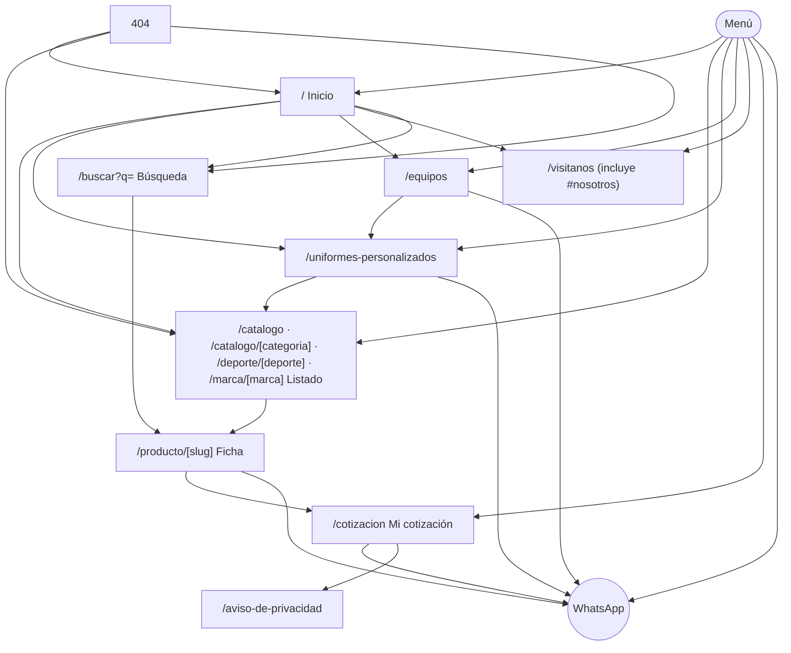
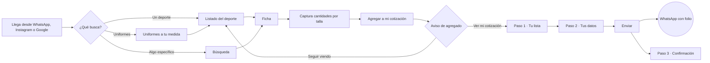
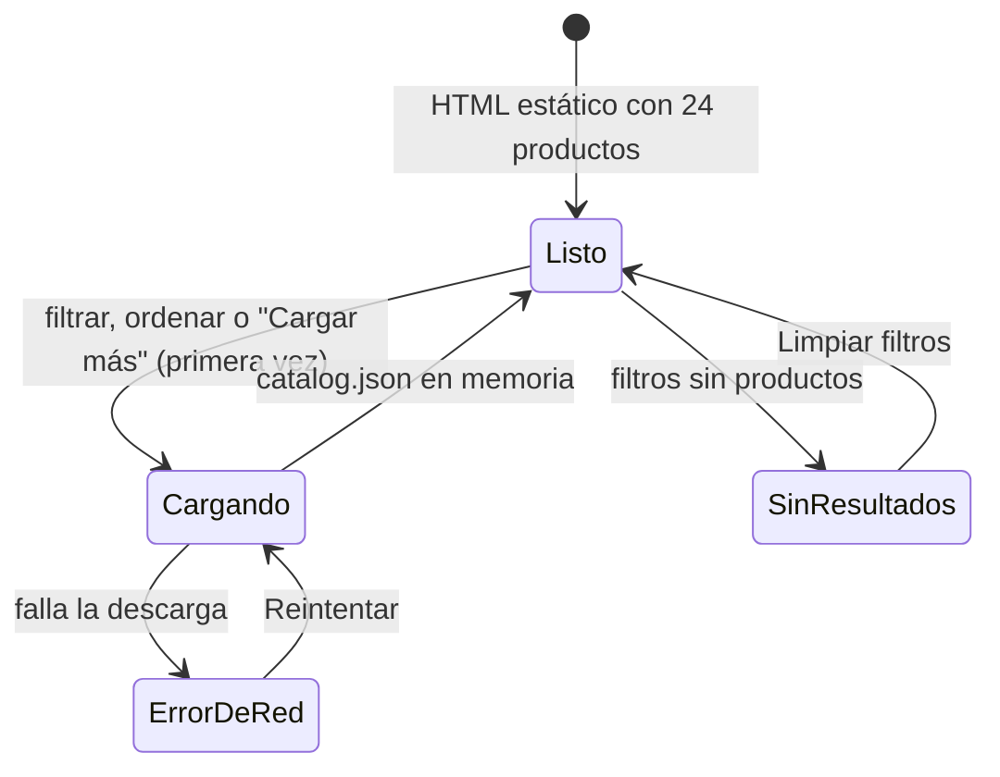
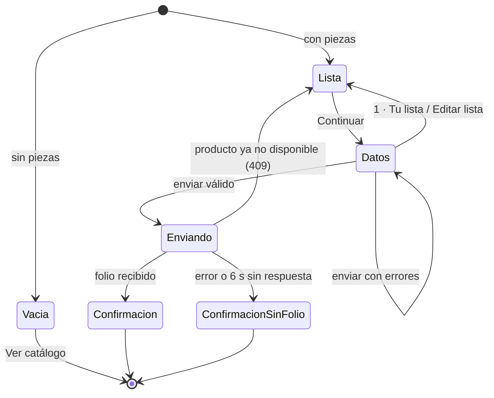
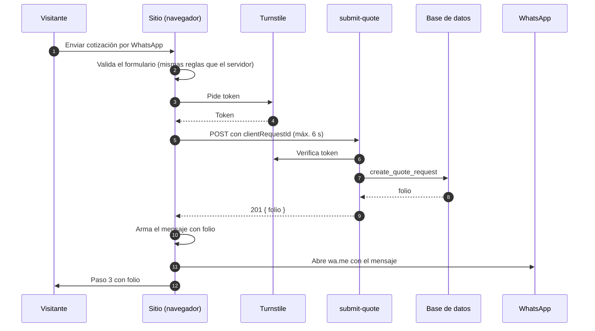
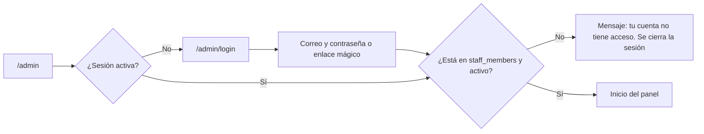
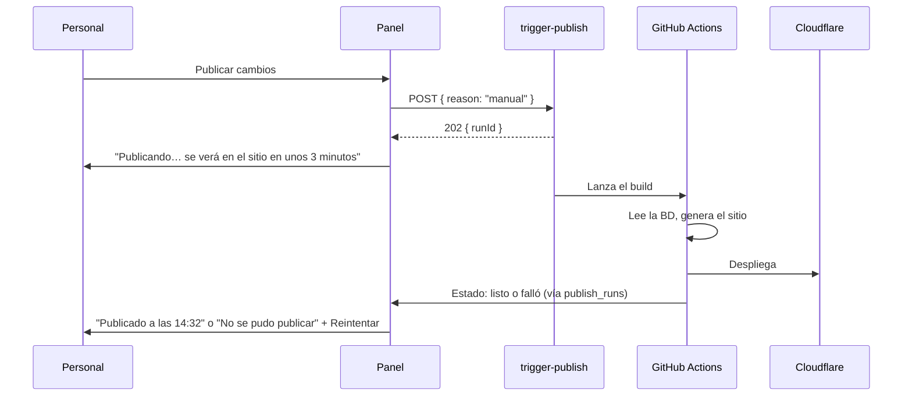

# 04 · App flow — Flujos de la aplicación

> **Documento para construir.** Describe paso a paso qué hace el visitante, qué hace el personal y qué pasa por detrás, incluidos los casos de error. Las pantallas citadas están en `design/screens/` (nombres de `03-UI-UX.md` §8).
>
> | Campo | Valor |
> |---|---|
> | Versión | 0.1 |
> | Fecha | 1-oct-2026 |
> | Documentos relacionados | `01-PRD.md` (requisitos) · `02-TRD.md` (cómo) · `03-UI-UX.md` (pantallas) · `05-BACKEND-SCHEMA.md` (datos y funciones) |

---

## 1. Mapa del sitio

Presentes en todas las páginas públicas: header (menú, búsqueda, "Mi cotización"), footer y el botón flotante de WhatsApp (excepto en `/cotizacion`). En móvil, además, la barra "Mi cotización" cuando hay piezas.

### Rutas y qué las genera

| Ruta | Tipo | Notas |
|---|---|---|
| `/`, `/uniformes-personalizados`, `/equipos`, `/visitanos`, `/aviso-de-privacidad` | Estática | Contenido leído de la BD en el build |
| `/catalogo`, `/catalogo/[categoria]`, `/catalogo/[categoria]/[sub]`, `/deporte/[deporte]`, `/marca/[marca]` | Estática + filtros en cliente | La primera tanda (24) va en el HTML; filtros, orden y "Cargar más" usan `catalog.json` |
| `/producto/[slug]` | Estática | Una por producto publicado |
| `/buscar` | Cliente | Lee `?q=` y busca en `catalog.json` |
| `/cotizacion` | Cliente | Tres pasos en una página (§4) |
| `/admin/*` | Cliente, protegida | §8 |
| Cualquier otra | `404.html` | |

Parámetros de URL del listado: `?deporte=`, `?categoria=`, `?marca=`, `?para=`, `?personalizable=1`, `?orden=destacados|nuevos|nombre|marca`. Varios valores separados por coma. Compartir la URL reproduce la misma vista.

## 2. Flujo principal del visitante

Meta de diseño: un delegado que ya sabe qué quiere llega de Inicio a WhatsApp en menos de 3 minutos.

## 3. Explorar y encontrar

### 3.1 Menú
- **Móvil:** el ícono de menú abre la pantalla `menu`. "Deportes" y "Categorías" son acordeones (uno abierto a la vez). Elegir un deporte o categoría navega al listado y cierra el menú. El ícono cambia a "×"; Escape o "×" cierran.
- **Escritorio:** "Deportes" o "Categorías" abren el mega menú con velo. Clic fuera, Escape o elegir un destino lo cierran.

### 3.2 Listado

1. La página llega ya pintada con la primera tanda. No hay esqueleto en la primera vista.
2. Al tocar un filtro, cambiar el orden o "Cargar más" por primera vez se descarga `catalog.json` (una sola vez por visita). Mientras tanto se muestra `catalogo-cargando`.
3. Los filtros se aplican al instante y actualizan la URL (`history.replaceState`, sin recargar).
4. **Filtros en móvil:** "Filtrar (n)" abre la hoja `catalogo-filtros`. Los cambios se aplican al tocar "Ver n productos"; "Limpiar" quita todos. Cerrar con "×" descarta los cambios no aplicados.
5. **Filtros en escritorio:** panel lateral; cada casilla aplica de inmediato.
6. **Ordenar:** hoja en móvil, menú en escritorio. Elegir una opción la aplica y cierra.
7. Los filtros activos aparecen como chips con "×" sobre la cuadrícula.
8. **Sin productos:** `catalogo-sin-resultados` con una sola acción, "Limpiar filtros".
9. **Error de red al cargar `catalog.json`:** el listado estático sigue visible, y un aviso ofrece "Reintentar" y WhatsApp.

### 3.3 Búsqueda
1. Móvil: tocar la lupa convierte el header en campo de búsqueda con foco. Escritorio: el campo ya está en el header.
2. Mientras se escribe (desde 2 caracteres, con 150 ms de espera) se muestran hasta 6 productos y 3 categorías sugeridas.
3. Enter o "buscar" navega a `/buscar?q=…` (`busqueda`): resultados por relevancia, chips para acotar por categoría, filtros y orden como en el listado.
4. **Sin resultados** (`busqueda-sin-resultados`): se muestra la corrección sugerida si existe ("¿Quisiste decir balón?" → repite la búsqueda con ese término), accesos por deporte y por categoría y "Pregunta por WhatsApp" con el mensaje `Hola, busco "{q}" y no lo encontré en el catálogo.`
5. `/buscar` sin `q` muestra el campo con foco y los accesos por deporte.
6. Evento de analítica `search` con el término y el número de resultados.

## 4. Cotización

### 4.1 Agregar a la lista

| Origen | Qué pasa |
|---|---|
| Tarjeta con una sola variante ("+ Cotizar") | Agrega 1 pieza de la variante por defecto y abre el aviso de agregado |
| Tarjeta con variantes ("Ver tallas") | Lleva a la ficha |
| Ficha completa (`ficha-uniforme`) | El visitante captura cantidades por talla (o usa un atajo "Equipo de 12 / 18 / 24"), marca "Quiero personalizarlo" si aplica y escribe el detalle. "Agregar a mi cotización" crea una línea por cada variante con cantidad mayor a 0 |
| Ficha sencilla (`ficha-balon`) | Igual, sin atajos ni personalización |

Reglas:
- Con 0 piezas no hay botón; se lee "Indica cuántas piezas necesitas por talla".
- Si la variante ya está en la lista, **se suman** las cantidades (tope 9 999 por línea). La nota de personalización nueva sustituye a la anterior si no está vacía.
- Tras agregar, las cantidades de la ficha vuelven a 0 y se abre el aviso `ficha-agregado` con dos salidas: **"Ver mi cotización"** (va al paso 1) y **"Seguir viendo el catálogo"** (cierra y, si se llegó desde un listado, regresa a él).
- Al llegar a 100 líneas se avisa: "Tu lista llegó al máximo de 100 renglones. Envíala y arma otra para el resto."
- "Preguntar por este producto" abre WhatsApp con `Hola, me interesa *{nombre}* ({sku}). {url}` y no toca la lista.

### 4.2 Los tres pasos de `/cotizacion`

| URL | Estado | Pantalla |
|---|---|---|
| `/cotizacion` | Lista (o vacía) | `cotizacion-1-lista` · `cotizacion-vacia` |
| `/cotizacion?paso=2` | Datos | `cotizacion-2-datos` |
| `/cotizacion?enviada=PYP-2026-000123` | Confirmación | `cotizacion-3-confirmacion` |
| `/cotizacion?enviada=1` | Confirmación sin folio | Variante sin placa de folio |

- Entrar a `?paso=2` con la lista vacía redirige al paso 1.
- El botón "atrás" del navegador regresa un paso (cada paso es una entrada del historial).
- Recargar la confirmación la vuelve a mostrar (el último envío se guarda en `sessionStorage`); en otra sesión, `?enviada=` sin datos redirige al paso 1.

**Paso 1 · Tu lista**
- Cambiar cantidades, quitar un producto (ícono de basura; aviso "Quitaste {producto}" con "Deshacer" durante 5 s) y "+ Seguir agregando productos".
- "Editar" en la personalización abre `cotizacion-editar-personalizacion`: guardar actualiza todas las líneas del producto; "Quitar personalización" la borra; "Cancelar", "×" o Escape descartan.
- Productos que dejaron de estar publicados se marcan "No disponible" y hay que quitarlos para continuar.

**Paso 2 · Tus datos**
- Los datos de una solicitud anterior aparecen prellenados (se guardan en el navegador).
- "¿Para cuándo lo necesitas?": fecha mínima hoy; los atajos ponen hoy + 7, + 14 y + 30 días.
- "Nombre del equipo o institución" se oculta si se elige "Particular".
- Al enviar con errores se muestra `cotizacion-2-datos-errores`: resumen arriba (con el foco) y mensaje en cada campo. Los errores de un campo se limpian al corregirlo.

**Paso 3 · Confirmación**
- Folio con botón de copiar, "Abrir WhatsApp" (siempre visible, por si el navegador bloqueó la apertura automática), "Seguir viendo el catálogo" y "Vaciar mi lista".
- La lista **no** se vacía sola: el cliente puede necesitar reenviar o ajustar. Si vuelve a enviar la misma lista, se genera otra solicitud con folio nuevo.

### 4.3 Envío

| Qué falla | Qué ve el visitante | Qué pasa por detrás |
|---|---|---|
| Validación en el navegador | Resumen de errores; no se envía nada | — |
| Turnstile no carga o falla | Se envía sin folio | `quote_submit_error` con motivo `turnstile` |
| La función tarda más de 6 s o responde 5xx | Se abre WhatsApp con el mensaje completo **sin folio** y se muestra la confirmación sin folio | Evento `quote_submit_error`. Si la solicitud sí se guardó, el asesor la verá en el panel de todos modos |
| `429` (demasiados envíos) | Igual: WhatsApp sin folio | — |
| `409` (un producto ya no está disponible) | Regresa al paso 1 con ese producto marcado y el aviso "Este producto ya no está disponible. Quítalo para enviar tu lista." | — |
| Doble toque en el botón | El botón se desactiva y dice "Enviando…" | El mismo `clientRequestId` devuelve el mismo folio |
| El navegador bloquea la apertura de WhatsApp | La confirmación tiene el botón "Abrir WhatsApp" | — |
| Sin conexión | "Sin conexión. Tu lista está guardada: inténtalo de nuevo cuando tengas señal." | Nada se pierde: la lista está en el navegador |

**Regla de oro:** un fallo técnico nunca impide que el cliente mande su lista por WhatsApp.

El `clientRequestId` se genera al entrar al paso 2 y se renueva solo después de un envío exitoso.

### 4.4 Mensaje de WhatsApp
Formato y versión compacta en el TRD §6.5. El número de destino sale de `settings.whatsapp_sales_number`. El asesor recibe el mensaje y, con el folio, abre la solicitud en el panel.

### 4.5 Persistencia en el navegador

| Clave | Contenido | Vida |
|---|---|---|
| `localStorage: pyp.quote.v1` | Líneas de la lista | Hasta que el visitante la vacíe; se descarta si tiene más de 30 días sin cambios |
| `localStorage: pyp.requester.v1` | Datos del solicitante (sin la casilla de privacidad) | Igual |
| `sessionStorage: pyp.lastSubmission` | Folio y mensaje del último envío | La sesión |
| Memoria | `catalog.json` | La visita |

Si el navegador no permite almacenamiento (modo privado estricto), la lista vive en memoria durante la visita y se avisa: "Tu lista no se guardará si cierras esta página."

## 5. Páginas de contenido

| Página | Acciones | Destino |
|---|---|---|
| Uniformes a tu medida | "Ver uniformes" | `/catalogo/uniformes` |
| | "Arma tu lista" | `/catalogo/uniformes` |
| | "Cotiza por WhatsApp", "Escríbele a Ana" | WhatsApp: `Hola, quiero cotizar uniformes para mi equipo.` |
| Equipos estrenando | Filtro por deporte, "Cargar más" | En la misma página |
| | "Enviar foto" | WhatsApp: `Hola, quiero compartir la foto de mi equipo con su uniforme.` |
| | "Cotiza tu uniforme" | `/uniformes-personalizados` |
| Visítanos | "Cómo llegar" | Google Maps con las coordenadas de la tienda |
| | "Llamar" | `tel:` |
| | Filas de contacto | WhatsApp, `tel:`, Instagram, Facebook |
| Inicio | "Cotiza por WhatsApp" | WhatsApp: `Hola, quiero cotizar.` |

"Abierto ahora / Cerrado": se calcula en el navegador con el horario de la tienda y la hora de `America/Mexico_City`. Textos: "Abierto ahora · cierra 19:00", "Cerrado · abre hoy 10:00", "Cerrado · abre mañana 10:00", "Cerrado · abre el lunes 10:00".

## 6. Analítica por paso

| Paso | Evento | Datos |
|---|---|---|
| Ver listado | `view_item_list` | lista, productos visibles |
| Buscar | `search` | término, resultados |
| Ver ficha | `view_item` | producto |
| Agregar | `add_to_quote` | producto, variantes, piezas |
| Abrir la lista | `view_quote` | productos, piezas |
| Continuar al paso 2 | `begin_quote_form` | productos, piezas |
| Enviar con éxito | `submit_quote` | folio, productos, piezas, tipo de cliente |
| Envío con fallo | `quote_submit_error` | motivo |
| Cualquier salida a WhatsApp | `whatsapp_click` | origen: `floating`, `product`, `confirmation`, `quote`, `menu`, `uniforms`, `gallery`, `search` |

Embudo a seguir: `view_item` → `add_to_quote` → `view_quote` → `begin_quote_form` → `submit_quote`.

## 7. Flujo del asesor (fuera del sitio)

1. Llega el mensaje de WhatsApp con el folio.
2. Abre el panel → Solicitudes → busca el folio. La solicitud está en **Nueva**.
3. La pasa a **En atención** y contesta al cliente.
4. Envía el precio → **Cotizada**.
5. El cliente acepta → **Ganada**. No acepta → **Perdida**, con motivo.

Si el mensaje llegó **sin folio**, el asesor atiende igual; la solicitud puede o no estar en el panel (búsqueda por teléfono).

## 8. Panel de administración

### 8.1 Acceso

No hay registro público. Un admin invita desde Ajustes → Usuarios; el invitado recibe un correo para crear su contraseña.

### 8.2 Alta de un producto
1. Productos → "Nuevo".
2. Básico: nombre (el slug se propone solo), marca, categoría y subcategoría, deportes, público, descripción corta.
3. Variantes: escribe tallas y colores → "Generar variantes" → revisa los SKU.
4. Fotos: toma o elige fotos → recorta a 4:5 → se suben (barra de progreso por foto) → ordena y escribe el texto alternativo.
5. Personalización: marca si es personalizable y con qué técnicas.
6. "Guardar" lo deja en **Borrador**. "Vista previa" muestra la ficha real.
7. "Publicar" lo pasa a **Publicado**. Aparece el aviso "Hay cambios sin publicar".
8. "Publicar cambios" (§8.6) lo lleva al sitio.

Archivar un producto lo quita del sitio en la siguiente publicación; las solicitudes anteriores conservan su nombre y SKU.

### 8.3 Importación masiva
1. Productos → "Importar" → descarga la plantilla o sube un CSV/XLSX.
2. Vista previa: filas válidas y filas con error (con el motivo). Se puede continuar solo con las válidas.
3. "Importar n productos": se envían en lotes de 50; barra de progreso.
4. Resultado: creados, actualizados y errores, con opción de descargar los errores en CSV.
5. Fotos en lote: se arrastran archivos nombrados por SKU (`BAL-001.jpg`, `BAL-001-2.jpg`); se muestran las que no coincidieron con ningún SKU.

### 8.4 Solicitudes
- Bandeja ordenada por fecha, con filtros por estado y rango de fechas y búsqueda por folio, nombre o teléfono.
- Detalle: datos del cliente, líneas, notas, historial. "Abrir chat" abre `wa.me` con el teléfono del cliente. Cambio de estado en un toque (transiciones de `05-BACKEND-SCHEMA.md` §4.5); "Perdida" pide motivo.
- "Exportar CSV" con los filtros aplicados.

### 8.5 Galería, fotos y textos del sitio
- **Galería:** subir foto → nombre del equipo, deporte, año → casillas de autorización (obligatorias para publicar; si hay menores, también la de tutores) → publicar.
- **Fotos del sitio:** un recuadro por espacio (portada, uniformes, tres muestras, tienda, taller, asesora). Subir, recortar a la proporción del espacio y escribir el texto alternativo. "Quitar" deja el marcador.
- **Textos:** preguntas frecuentes, historia, referencias para llegar, asesora y aviso de privacidad (al guardar el aviso se pide confirmar si cambia la versión).

### 8.6 Publicar cambios

- El panel consulta `publish_runs` cada 10 s mientras hay una publicación en curso.
- Si falla, el sitio anterior sigue en línea; el panel muestra el motivo y "Reintentar".
- Cada noche (03:00) se publica solo si hay cambios pendientes.

## 9. Procesos automáticos

| Proceso | Cuándo | Qué hace |
|---|---|---|
| Latido | Diario 09:00 | Llama a `ping()` para que Supabase no pause el proyecto |
| Publicación nocturna | Diario 03:00 | `trigger-publish` con `reason: "nightly"`; no hace nada si no hay cambios |
| Respaldo | Domingo 04:00 | `pg_dump` a R2 privado |

## 10. Qué cambia en modo tienda (fase e-commerce)

| Hoy (modo catálogo) | Después (modo tienda) |
|---|---|
| Sin precios | Precio y escalas por volumen en tarjeta y ficha |
| "Agregar a mi cotización" | "Agregar al carrito" |
| Paso 2: datos → WhatsApp | Paso 2: datos y entrega → paso 3: pago |
| Solicitud con folio | Pedido con folio y pago |
| El asesor cierra por WhatsApp | El pago cierra la venta; WhatsApp queda para dudas y cotizaciones especiales |

La lista, sus líneas, los clientes y las pantallas son los mismos. La opción "Cotizar por WhatsApp" se conserva para pedidos con personalización.
