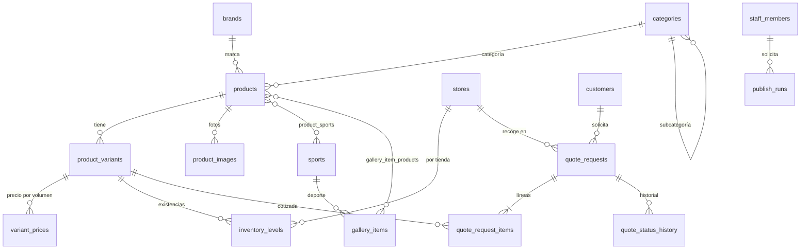
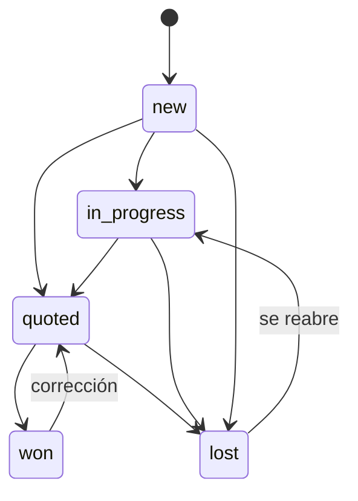

# 05 · Esquema del backend

> **Documento para construir.** Define la base de datos (Supabase / Postgres), su seguridad, las funciones y los contratos de las Edge Functions. Claude Code escribe las migraciones a partir de aquí.
>
> | Campo | Valor |
> |---|---|
> | Versión | 0.1 |
> | Fecha | 1-oct-2026 |
> | Documentos relacionados | `02-TRD.md` (arquitectura) · `04-APP-FLOW.md` (cuándo se llama cada cosa) · `data/sitio-actual.md` (taxonomía y formato del CSV) |

---

## 1. Principios

1. **Esquema de comercio completo desde v1.** Producto → variante (SKU) → precios por volumen → existencias por tienda. En modo catálogo los precios y existencias existen pero no salen al sitio.
2. **Todo producto tiene al menos una variante.** Un producto "sin variantes" tiene una sola variante por defecto (`is_default = true`, mismo SKU que el producto). Así la lista de cotización, los precios y el inventario siempre apuntan a una variante.
3. **El sitio público nunca lee tablas, solo vistas `public_*`.** Las vistas filtran lo publicado y omiten columnas comerciales y privadas.
4. **RLS activado en todas las tablas.** `anon` no tiene políticas sobre tablas base. El personal entra con políticas basadas en `staff_members`.
5. **Las escrituras públicas pasan por Edge Functions** (con `service_role`), nunca por inserciones directas del navegador.
6. **Las fotos no viven en la base de datos:** se guarda la clave base del archivo en R2 y sus medidas.
7. **Nada se cambia a mano en el dashboard.** Todo cambio es una migración SQL versionada en `supabase/migrations/`.
8. Nombres de tablas y columnas en inglés, `snake_case`. Dinero en **centavos** (`integer`) y moneda `MXN`. Fechas en `timestamptz`; el "día" de negocio se calcula en `America/Mexico_City`.

## 2. Diagrama



Tablas sin relaciones: `site_media`, `site_texts`, `settings`, `folio_counters`, `system_heartbeats`.

## 3. Extensiones y tipos

```sql
create extension if not exists unaccent;
create extension if not exists pg_trgm;

create type staff_role        as enum ('admin', 'editor');
create type product_status    as enum ('draft', 'published', 'archived');
create type audience          as enum ('adulto', 'infantil', 'unisex');
create type customer_type     as enum ('league_team', 'school_academy', 'company_institution', 'individual');
create type delivery_method   as enum ('pickup', 'shipping');
create type quote_status      as enum ('new', 'in_progress', 'quoted', 'won', 'lost');
create type content_status    as enum ('draft', 'published');
create type publish_status    as enum ('queued', 'running', 'success', 'failed');
```

Etiquetas en español para la interfaz (en `packages/shared`):

| Tipo | Valores → etiqueta |
|---|---|
| `customer_type` | `league_team` Liga o equipo · `school_academy` Escuela o academia · `company_institution` Empresa o institución · `individual` Particular |
| `delivery_method` | `pickup` Recoger en tienda Coapa · `shipping` Envío (lo acordamos por WhatsApp) |
| `quote_status` | `new` Nueva · `in_progress` En atención · `quoted` Cotizada · `won` Ganada · `lost` Perdida |
| `product_status` | `draft` Borrador · `published` Publicado · `archived` Archivado |
| Técnicas (`text[]`) | `sublimacion` · `vinil` · `bordado` · `serigrafia` |

## 4. Tablas

Todas llevan `created_at timestamptz not null default now()`; las editables llevan además `updated_at` mantenido por el trigger `set_updated_at`. Se omiten en los listados para abreviar.

### 4.1 Personal

```sql
create table staff_members (
  user_id    uuid primary key references auth.users(id) on delete cascade,
  role       staff_role not null default 'editor',
  full_name  text not null,
  is_active  boolean not null default true
);
```

### 4.2 Taxonomía

```sql
create table sports (
  id          uuid primary key default gen_random_uuid(),
  slug        text not null unique check (slug ~ '^[a-z0-9-]+$'),
  name        text not null,
  sort_order  int  not null default 0,
  is_active   boolean not null default true
);

create table categories (
  id            uuid primary key default gen_random_uuid(),
  parent_id     uuid references categories(id) on delete restrict,   -- null = categoría; con valor = subcategoría
  slug          text not null unique check (slug ~ '^[a-z0-9-]+$'),
  name          text not null,
  size_label    text not null default 'Talla',                       -- 'Talla' | 'Tamaño' | 'Peso': nombre de la opción 1 por defecto
  sort_order    int  not null default 0,
  is_active     boolean not null default true
);
-- Un solo nivel de subcategorías: trigger que impide que parent_id apunte a una subcategoría.

create table brands (
  id            uuid primary key default gen_random_uuid(),
  slug          text not null unique check (slug ~ '^[a-z0-9-]+$'),
  name          text not null,
  logo_key      text,                    -- clave base en R2, opcional
  is_own_brand  boolean not null default false,
  sort_order    int not null default 0
);
```

`size_label` inicial: `balones` → Tamaño · `box-y-combate` → Peso · `material-entrenamiento` → Tamaño · resto → Talla.

### 4.3 Catálogo

```sql
create table products (
  id                 uuid primary key default gen_random_uuid(),
  sku                text not null unique,
  slug               text not null unique check (slug ~ '^[a-z0-9-]+$'),
  name               text not null,
  brand_id           uuid not null references brands(id),
  category_id        uuid not null references categories(id),
  subcategory_id     uuid references categories(id),
  audience           audience not null default 'unisex',
  short_description  text not null default '',
  description        text not null default '',
  specs              jsonb not null default '[]',      -- [{ "label": "Tela", "value": "…" }]
  tags               text[] not null default '{}',
  option1_name       text not null default 'Talla',    -- se inicializa con categories.size_label
  option2_name       text,                             -- 'Color' o null
  color_note         text,                             -- p. ej. 'A elegir' cuando el color no es variante
  is_customizable    boolean not null default false,
  techniques         text[] not null default '{}'
                     check (techniques <@ array['sublimacion','vinil','bordado','serigrafia']),
  min_suggested_qty  int check (min_suggested_qty > 0),
  is_featured        boolean not null default false,
  sort_order         int not null default 0,
  status             product_status not null default 'draft',
  published_at       timestamptz,                      -- se fija la primera vez que pasa a 'published'
  legacy_url         text,                             -- URL del sitio WordPress, para redirecciones
  search_text        text not null default '',         -- minúsculas sin acentos; lo mantiene un trigger
  created_by         uuid references auth.users(id)
);
create index on products (status, is_featured desc, sort_order);
create index on products (category_id);
create index on products using gin (search_text gin_trgm_ops);

create table product_sports (
  product_id uuid not null references products(id) on delete cascade,
  sport_id   uuid not null references sports(id) on delete restrict,
  primary key (product_id, sport_id)
);

create table product_variants (
  id             uuid primary key default gen_random_uuid(),
  product_id     uuid not null references products(id) on delete cascade,
  sku            text not null unique,
  option1_value  text,              -- 'CH', '#5', '16oz'… null en la variante por defecto
  option2_value  text,              -- 'Rojo'… o null
  is_default     boolean not null default false,
  is_active      boolean not null default true,
  sort_order     int not null default 0,
  unique nulls not distinct (product_id, option1_value, option2_value)   -- Postgres 15+
);
create unique index one_default_variant on product_variants (product_id) where is_default;

create table product_images (
  id          uuid primary key default gen_random_uuid(),
  product_id  uuid not null references products(id) on delete cascade,
  variant_id  uuid references product_variants(id) on delete set null,
  key_base    text not null unique,     -- 'p/{productId}/{imageId}'  → archivos '{key_base}-{320|640|1024|1600}.webp'
  alt         text not null default '',
  width       int not null,             -- del original recortado (4:5)
  height      int not null,
  sort_order  int not null default 0
);
```

**Reglas del catálogo**
- Un producto solo puede publicarse si tiene nombre, marca, categoría y al menos una variante activa (trigger `validate_product_publish`).
- "Tiene variantes" en la interfaz = más de una variante activa. Con una sola, la tarjeta muestra "+ Cotizar".
- SKU de variante: `{sku}-{OPCION1}-{OPCION2}` en mayúsculas, sin acentos y con guiones (`BAL-005-5-BLANCO-ROJO`). La variante por defecto usa el SKU del producto.
- El importador genera variantes como producto cartesiano de tallas × colores. Si `tallas = unitalla` y no hay colores, crea solo la variante por defecto. Si `colores = "A elegir"`, no crea dimensión de color y guarda `color_note`.

### 4.4 Comercio oculto (modo catálogo) y tienda

```sql
create table variant_prices (
  variant_id        uuid not null references product_variants(id) on delete cascade,
  min_qty           int  not null default 1 check (min_qty >= 1),   -- escala por volumen
  unit_price_cents  int  not null check (unit_price_cents >= 0),
  currency          char(3) not null default 'MXN',
  primary key (variant_id, min_qty)
);

create table stores (
  id            uuid primary key default gen_random_uuid(),
  slug          text not null unique,
  name          text not null,
  street        text not null,
  neighborhood  text not null,
  borough       text not null,
  postal_code   text not null,
  city          text not null default 'Ciudad de México',
  lat           numeric(9,6),
  lng           numeric(9,6),
  phone         text,
  email         text,
  hours         jsonb not null default '[]',   -- [{ "days": [1,2,3,4,5], "open": "10:00", "close": "19:00" }] (1 = lunes)
  directions    text not null default '',      -- referencias para llegar y estacionamiento
  is_active     boolean not null default true,
  sort_order    int not null default 0
);

create table inventory_levels (
  variant_id  uuid not null references product_variants(id) on delete cascade,
  store_id    uuid not null references stores(id) on delete cascade,
  quantity    int  not null default 0,
  primary key (variant_id, store_id)
);
```

### 4.5 Clientes y solicitudes de cotización

```sql
create table customers (
  id             uuid primary key default gen_random_uuid(),
  phone          text not null unique check (phone ~ '^[0-9]{10}$'),   -- 10 dígitos, sin +52
  name           text not null,
  customer_type  customer_type not null,
  organization   text,
  quote_count    int not null default 0,
  first_seen_at  timestamptz not null default now(),
  last_seen_at   timestamptz not null default now()
);

create table folio_counters (
  year        int primary key,
  last_value  int not null default 0
);

create table quote_requests (
  id                   uuid primary key default gen_random_uuid(),
  folio                text not null unique,                 -- 'PYP-2026-000123'
  client_request_id    uuid not null unique,                 -- idempotencia
  customer_id          uuid not null references customers(id),
  status               quote_status not null default 'new',
  -- copia de los datos tal como se enviaron
  customer_name        text not null,
  customer_phone       text not null,
  customer_type        customer_type not null,
  organization         text,
  needed_by            date not null,
  delivery_method      delivery_method not null,
  store_id             uuid references stores(id),
  requires_invoice     boolean not null default false,
  note                 text not null default '',
  total_pieces         int not null check (total_pieces > 0),
  -- seguimiento interno
  lost_reason          text,
  internal_note        text not null default '',
  -- privacidad y abuso
  privacy_accepted_at  timestamptz not null,
  privacy_version      text not null,
  ip_hash              text,
  user_agent           text
);
create index on quote_requests (status, created_at desc);
create index on quote_requests (ip_hash, created_at);

create table quote_request_items (
  id                 uuid primary key default gen_random_uuid(),
  quote_request_id   uuid not null references quote_requests(id) on delete cascade,
  line_no            int not null,
  product_id         uuid references products(id) on delete set null,
  variant_id         uuid references product_variants(id) on delete set null,
  product_name       text not null,       -- copia: el producto puede cambiar o borrarse después
  sku                text not null,
  variant_label      text,                -- 'M', '#5 · Blanco/Rojo'
  quantity           int not null check (quantity between 1 and 9999),
  personalize        boolean not null default false,
  notes              text not null default '' check (char_length(notes) <= 500),
  unit_price_cents   int,                 -- vacío en modo catálogo
  unique (quote_request_id, line_no)
);

create table quote_status_history (
  id                bigint generated always as identity primary key,
  quote_request_id  uuid not null references quote_requests(id) on delete cascade,
  from_status       quote_status,
  to_status         quote_status not null,
  changed_by        uuid references auth.users(id),
  note              text not null default ''
);
```

**Folio:** `PYP-{año}-{consecutivo de 6 dígitos}`. El año es el de `America/Mexico_City`. El consecutivo reinicia cada año y se toma de `folio_counters` con bloqueo de fila (`insert … on conflict do update … returning`), dentro de la misma transacción que crea la solicitud.

**Transiciones de estado** (las valida `admin_set_quote_status`):



`lost` exige `lost_reason`.

### 4.6 Galería

```sql
create table gallery_items (
  id                    uuid primary key default gen_random_uuid(),
  team_name             text not null,
  sport_id              uuid references sports(id),
  year                  int,
  key_base              text not null unique,    -- 'g/{galleryId}/{imageId}'
  alt                   text not null default '',
  width                 int not null,
  height                int not null,
  includes_minors       boolean not null default false,
  has_written_consent   boolean not null default false,
  has_guardian_consent  boolean not null default false,
  status                content_status not null default 'draft',
  sort_order            int not null default 0,
  constraint consent_to_publish check (
    status = 'draft'
    or (has_written_consent and (not includes_minors or has_guardian_consent))
  )
);

create table gallery_item_products (
  gallery_item_id uuid not null references gallery_items(id) on delete cascade,
  product_id      uuid not null references products(id) on delete cascade,
  primary key (gallery_item_id, product_id)
);
```

### 4.7 Fotos y textos del sitio, ajustes

```sql
create table site_media (
  slot        text primary key check (slot in (
                'home_hero', 'uniforms_hero',
                'technique_sublimacion', 'technique_vinil', 'technique_bordado',
                'store_front', 'store_workshop', 'advisor')),
  key_base    text,                 -- 's/{slot}/{imageId}'; null = sin foto (el sitio muestra el marcador)
  alt         text not null default '',
  width       int,
  height      int,
  updated_by  uuid references auth.users(id)
);

create table site_texts (
  key         text primary key,
  value       jsonb not null,
  updated_by  uuid references auth.users(id)
);

create table settings (
  key        text primary key,
  value      jsonb not null,
  is_public  boolean not null default false
);
```

Claves de `site_texts`:

| Clave | Forma de `value` |
|---|---|
| `advisor` | `{ "name": "[Ana Martínez]", "role": "Asesora de uniformes", "quote": "…" }` |
| `uniforms_faq` | `[{ "question": "¿Cuál es el pedido mínimo?", "answer": "[PEDIDO MÍNIMO]" }, …]` |
| `store_history` | `{ "text": "[HISTORIA DE LA TIENDA]" }` |
| `privacy_notice` | `{ "version": "2026-10", "updatedAt": "[FECHA]", "sections": [{ "title": "Quién es responsable", "body": "…" }, …] }` |

Claves de `settings`:

| Clave | Valor inicial | Pública |
|---|---|---|
| `whatsapp_sales_number` | `"5500000000"` ⚠️ placeholder | Sí |
| `site_name` | `"P&P Deportes Coapa"` | Sí |
| `social` | `{ "instagram": "pyp_coapa", "facebook": "pypcoapa" }` | Sí |
| `flags` | `{ "show_prices": false, "enable_checkout": false, "enable_shipping": false, "enable_stock": false }` | Sí |
| `ga_measurement_id` | `null` | Sí |
| `quote_rate_limit` | `{ "per_ip_hour": 5, "per_phone_hour": 5 }` | No |

### 4.8 Operación

```sql
create table publish_runs (
  id            uuid primary key default gen_random_uuid(),
  status        publish_status not null default 'queued',
  reason        text not null default 'manual',     -- 'manual' | 'nightly' | 'push'
  requested_by  uuid references auth.users(id),
  run_url       text,
  error         text,
  finished_at   timestamptz
);

create table system_heartbeats (
  id      bigint generated always as identity primary key,
  source  text not null       -- 'cron'
);
-- Se conservan los últimos 90 días (lo limpia ping()).
```

## 5. Triggers

| Trigger | Tabla | Qué hace |
|---|---|---|
| `set_updated_at` | Todas las editables | `updated_at = now()` en cada `update` |
| `products_search_text` | `products` | `search_text = lower(unaccent(name ‖ sku ‖ tags ‖ marca))` |
| `products_published_at` | `products` | Fija `published_at` la primera vez que `status` pasa a `published` |
| `validate_product_publish` | `products` | Impide publicar sin marca, categoría o variante activa |
| `categories_one_level` | `categories` | Impide subcategorías de subcategorías |
| `ensure_default_variant` | `products` (after insert) | Crea la variante por defecto si el producto nace sin variantes |

## 6. Vistas públicas

Son lo único que lee el build del sitio (con la `anon key`). Se crean como vistas normales (se ejecutan con permisos de su dueño), con `grant select … to anon, authenticated`. **No** llevan `security_invoker`, a propósito: así `anon` no necesita acceso a las tablas base.

| Vista | Filtra | Columnas que **no** expone |
|---|---|---|
| `public_products` | `status = 'published'` | `created_by`, `search_text` |
| `public_product_variants` | variante activa de producto publicado | — (los precios están en otra tabla) |
| `public_product_images` | de productos publicados | — |
| `public_product_sports` | de productos publicados y deporte activo | — |
| `public_sports` | activos con al menos un producto publicado | — |
| `public_categories` | activas con al menos un producto publicado (propias o de sus subcategorías) | — |
| `public_brands` | con al menos un producto publicado | — |
| `public_stores` | `is_active` | — |
| `public_gallery_items` | `status = 'published'` | `has_written_consent`, `has_guardian_consent`, `includes_minors` |
| `public_gallery_item_products` | de elementos y productos publicados | — |
| `public_site_media` | todas las filas (con o sin foto) | `updated_by` |
| `public_site_texts` | todas | `updated_by` |
| `public_settings` | `is_public` | — |
| `public_variant_prices` | **solo devuelve filas si `flags.show_prices = true`** | — |
| `public_inventory` | **solo devuelve filas si `flags.enable_stock = true`** | — |

Las dos últimas permiten pasar a modo tienda cambiando un ajuste, sin migración.

## 7. Seguridad por fila (RLS)

Funciones de apoyo (`security definer`, `stable`, `search_path = public`):

```sql
create function is_staff() returns boolean language sql stable security definer as $$
  select exists (select 1 from staff_members where user_id = auth.uid() and is_active);
$$;
create function is_admin() returns boolean language sql stable security definer as $$
  select exists (select 1 from staff_members where user_id = auth.uid() and is_active and role = 'admin');
$$;
```

| Tablas | `anon` | Editor (`is_staff()`) | Admin (`is_admin()`) |
|---|---|---|---|
| `products`, `product_variants`, `product_images`, `product_sports`, `variant_prices`, `inventory_levels` | Sin acceso | Leer y escribir | Leer y escribir |
| `sports`, `categories`, `brands` | Sin acceso | Leer y escribir | Leer y escribir |
| `gallery_items`, `gallery_item_products`, `site_media`, `site_texts` | Sin acceso | Leer y escribir | Leer y escribir |
| `customers`, `quote_requests`, `quote_request_items`, `quote_status_history` | Sin acceso | Leer. Cambios solo con `admin_set_quote_status` y `admin_set_quote_note` | Igual + `admin_anonymize_customer` |
| `stores`, `settings` | Sin acceso | Leer | Leer y escribir |
| `staff_members` | Sin acceso | Leer su propia fila | Leer y escribir |
| `publish_runs` | Sin acceso | Leer | Leer |
| `folio_counters`, `system_heartbeats` | Sin acceso | Sin acceso | Leer |

Reglas:
- Nadie borra solicitudes ni clientes desde el cliente web; no hay política `delete` para ellos.
- `service_role` (Edge Functions, GitHub Actions) salta RLS; por eso su llave nunca sale del servidor.
- Borrar un producto con solicitudes asociadas no rompe el historial: las líneas conservan nombre y SKU.

**Pruebas pgTAP obligatorias** (`supabase/tests/`):
1. `anon` no puede leer ninguna tabla base.
2. `anon` ve en `public_products` solo productos publicados.
3. `public_variant_prices` devuelve 0 filas con `show_prices = false` y filas con `true`.
4. Un editor no puede modificar `settings`, `stores` ni `staff_members`.
5. Un editor no puede hacer `update` directo de `quote_requests.status`.
6. No se puede publicar un `gallery_item` sin consentimiento.
7. `create_quote_request` con el mismo `client_request_id` devuelve el mismo folio y no duplica.
8. Dos llamadas simultáneas a `next_folio` no repiten consecutivo.

## 8. Funciones (RPC)

| Función | Quién la ejecuta | Qué hace |
|---|---|---|
| `next_folio()` → `text` | Interna | Devuelve el siguiente folio del año en curso (CDMX) |
| `create_quote_request(payload jsonb)` → `jsonb` | Solo `service_role` | Ver §8.1 |
| `admin_set_quote_status(id uuid, to_status quote_status, note text, lost_reason text)` | Personal | Valida la transición, actualiza y escribe en `quote_status_history` |
| `admin_set_quote_note(id uuid, internal_note text)` | Personal | Actualiza la nota interna |
| `admin_import_products(rows jsonb)` → `jsonb` | Personal | Ver §8.2 |
| `admin_replace_variants(product_id uuid, option1 text[], option2 text[])` | Personal | Regenera variantes conservando las que ya existen (no cambia sus `id`) y desactivando las que sobran |
| `admin_dashboard_stats()` → `jsonb` | Personal | Solicitudes nuevas, de los últimos 7 y 30 días, por estado, productos sin foto, top 10 productos solicitados |
| `has_unpublished_changes()` → `boolean` | Personal | `true` si algún `updated_at` del contenido público es posterior al último `publish_runs` con `success` |
| `admin_anonymize_customer(id uuid)` | Admin | Derecho de cancelación (ARCO): sustituye nombre y teléfono por valores anónimos en el cliente y en sus solicitudes |
| `mark_publish_run(id uuid, status publish_status, run_url text, error text)` | Solo `service_role` | La llama GitHub Actions al iniciar y al terminar el build |
| `ping()` | `anon` | Inserta en `system_heartbeats` y borra latidos de más de 90 días. Mantiene activo el proyecto |

### 8.1 `create_quote_request`

Entrada (ya validada por la Edge Function):

```json
{
  "clientRequestId": "0b6f…",
  "customer": { "name": "Juan Pérez", "phone": "5512345678", "type": "league_team", "organization": "Liga Coapa Sub-12" },
  "neededBy": "2026-10-15",
  "deliveryMethod": "pickup",
  "requiresInvoice": true,
  "note": "Colores del club: verde y blanco.",
  "privacyVersion": "2026-10",
  "items": [
    { "variantId": "…", "quantity": 4, "personalize": true, "notes": "Escudo al pecho, nombre y número" }
  ],
  "meta": { "ipHash": "…", "userAgent": "…" }
}
```

Pasos, en una transacción:
1. Si ya existe una solicitud con ese `clientRequestId`, devuelve `{ "folio": "…", "duplicate": true }` y termina.
2. Verifica que cada `variantId` exista, esté activa y su producto publicado. Si alguna falla, lanza `invalid_items` con la lista.
3. Crea o actualiza el cliente por `phone` (nombre, tipo y organización más recientes; `quote_count + 1`; `last_seen_at`).
4. Obtiene el folio con `next_folio()`.
5. Inserta la solicitud con `store_id` = la única tienda activa cuando `deliveryMethod = 'pickup'`.
6. Inserta las líneas copiando `product_name`, `sku` y `variant_label` desde el catálogo (nunca desde el navegador).
7. Inserta la primera fila de `quote_status_history` (`null → new`).
8. Devuelve `{ "folio": "PYP-2026-000123", "id": "…", "duplicate": false }`.

### 8.2 `admin_import_products`

- Entrada: arreglo de hasta 50 filas con las columnas de `data/catalogo-inicial.csv` ya convertidas a JSON.
- Por fila, *upsert* por `sku`: crea marca, categoría y subcategoría si no existen; reemplaza deportes; genera variantes con `admin_replace_variants`.
- Si el producto ya existe, **no** cambia su `slug` (rompería enlaces) y avisa si el CSV trae uno distinto.
- Devuelve `{ "created": n, "updated": n, "errors": [{ "row": 3, "sku": "…", "message": "…" }] }`. Una fila con error no detiene las demás del lote.

## 9. Edge Functions

Comunes: CORS con lista de orígenes permitidos, respuestas JSON, errores con la forma `{ "error": { "code": "…", "message": "…", "fields": { … } } }`.

### 9.1 `submit-quote` (pública)

`POST /functions/v1/submit-quote`

```json
{
  "clientRequestId": "uuid",
  "turnstileToken": "…",
  "customer": { "name": "…", "phone": "5512345678", "type": "league_team", "organization": "…" },
  "neededBy": "2026-10-15",
  "deliveryMethod": "pickup",
  "requiresInvoice": false,
  "note": "…",
  "privacyAccepted": true,
  "privacyVersion": "2026-10",
  "items": [{ "variantId": "uuid", "quantity": 4, "personalize": false, "notes": "" }]
}
```

Validación (`QuoteSubmissionSchema`, compartido con el frontend):

| Campo | Regla |
|---|---|
| `customer.name` | 2 a 80 caracteres |
| `customer.phone` | Exactamente 10 dígitos |
| `customer.organization` | Opcional, hasta 120 |
| `neededBy` | Fecha ≥ hoy (CDMX) y ≤ hoy + 2 años |
| `note` | Hasta 1 000 caracteres |
| `privacyAccepted` | Debe ser `true` |
| `items` | 1 a 100; `quantity` 1 a 9 999; `notes` hasta 500 |

Orden de ejecución: CORS → verificar Turnstile → validar → límite de envíos (5 por hora por `ipHash` y 5 por teléfono, contando en `quote_requests`) → `create_quote_request`.

| Respuesta | Cuándo |
|---|---|
| `201 { "folio": "PYP-2026-000123" }` | Creada |
| `200 { "folio": "…", "duplicate": true }` | Reintento con el mismo `clientRequestId` |
| `400 validation_error` | Datos inválidos; `fields` indica cuáles |
| `403 turnstile_failed` | Token inválido o vencido |
| `409 invalid_items` | Algún producto ya no está disponible; `fields.items` trae los `variantId` |
| `429 rate_limited` | Demasiados envíos |
| `500 internal_error` | Cualquier otro fallo |

En cualquier respuesta distinta de 200/201, el frontend abre WhatsApp sin folio (salvo `409`, donde primero avisa qué producto quitar).

`ipHash = sha256(ip + IP_HASH_SALT)`. La IP nunca se guarda en claro.

### 9.2 `sign-upload` (personal)

`POST` con el JWT del usuario. Entrada: `{ "scope": "product" | "gallery" | "site", "ownerId": "uuid o slot", "imageId": "uuid", "widths": [320, 640, 1024, 1600], "contentType": "image/webp" }`. Verifica `is_staff()`. Devuelve una URL firmada `PUT` por ancho, con 600 s de vigencia y `Cache-Control` inmutable. Claves: `p/{productId}/{imageId}-{w}.webp`, `g/{galleryId}/…`, `s/{slot}/…`.

### 9.3 `trigger-publish` (personal o cron)

`POST` con JWT de personal, o con el encabezado `x-cron-secret`. Entrada: `{ "reason": "manual" | "nightly" }`. Crea la fila en `publish_runs` y lanza `workflow_dispatch` de `deploy.yml` con el `runId`. Si `reason = 'nightly'` y `has_unpublished_changes()` es falso, no lanza nada y responde `204`.

### 9.4 `invite-staff` (admin)

`POST` con JWT de admin. Entrada: `{ "email": "…", "fullName": "…", "role": "editor" }`. Invita al usuario con la API de administración de Auth y crea su fila en `staff_members`. El registro público está desactivado en Auth.

## 10. Lo que lee el build

El build consulta solo vistas `public_*` y genera:

**`/data/catalog.json`** (filtros, orden y búsqueda en el navegador):

```ts
type CatalogJson = {
  generatedAt: string;
  products: Array<{
    id: string; sku: string; slug: string; name: string;
    brand: { slug: string; name: string };
    category: string; subcategory: string | null;     // slugs
    sports: string[];                                  // slugs
    audience: 'adulto' | 'infantil' | 'unisex';
    customizable: boolean; featured: boolean; sortOrder: number;
    publishedAt: string;
    image: { keyBase: string; alt: string } | null;    // null → imagen genérica de la categoría
    option1Name: string; option2Name: string | null;
    variants: Array<{ id: string; sku: string; o1: string | null; o2: string | null }>;
    meta: string;                                      // '10 tallas · colores a elegir'
  }>;
  sports: Array<{ slug: string; name: string }>;
  categories: Array<{ slug: string; name: string; parent: string | null }>;
  brands: Array<{ slug: string; name: string }>;
};
```

**`/data/settings.json`**: `whatsappSalesNumber`, `flags`, `social`, `store` (dirección, horario, teléfono, coordenadas, referencias), `siteMedia` (por `slot`: `keyBase`, `alt`, medidas o `null`), `siteTexts` y `privacyVersion`.

Cada lectura se valida con Zod en el build; si un registro no cumple, el build falla indicando tabla e `id`.

## 11. Datos semilla

`supabase/seed.sql` (entorno local) y la migración inicial de datos (producción):

1. `settings` y `site_texts` con los valores de §4.7.
2. `site_media`: una fila por `slot`, sin foto.
3. `stores`: Coapa, con los datos de `data/sitio-actual.md` §2 (horario y coordenadas son placeholder).
4. `sports` (7), `categories` (10 + subcategorías) y `brands` (12 + 3 por validar) de `data/sitio-actual.md` §3.
5. Productos: **no** van en SQL. Se cargan con el importador desde `data/catalogo-inicial.csv`, que es además la prueba de aceptación del importador.
6. Solo en local: un usuario admin de desarrollo (`admin@pyp.test`).

## 12. Fase e-commerce (no se crea en v1)

Se agregan con migraciones nuevas, sin tocar lo existente:

| Tabla | Para qué |
|---|---|
| `orders`, `order_items` | Misma forma de líneas que `quote_request_items`, con precio y totales |
| `payments` | Intentos y confirmaciones de la pasarela (webhook) |
| `addresses`, `shipments` | Envíos |
| `customer_accounts` | Vincula `customers` con `auth.users` cuando haya cuentas de cliente |

Una solicitud ganada podrá convertirse en pedido (`orders.quote_request_id`).

## 13. Respaldo y conservación

- Respaldo semanal con `pg_dump` a un bucket privado de R2, 8 semanas de retención (TRD §17).
- Solicitudes y clientes se conservan mientras el negocio los necesite; el aviso de privacidad debe decir el plazo. `admin_anonymize_customer` atiende solicitudes de cancelación.
- `system_heartbeats`: 90 días. `publish_runs`: sin límite (pocas filas).
