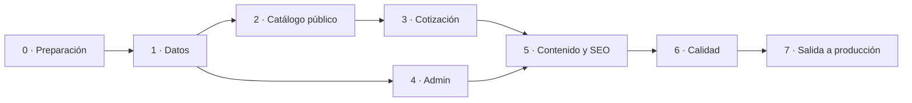

# 06 · Plan de implementación

> **Documento para construir.** Ordena el trabajo en fases y tareas que Claude Code ejecuta una por una. Cada tarea dice qué leer, qué entregar y cómo saber que está terminada.
>
> | Campo | Valor |
> |---|---|
> | Versión | 0.1 |
> | Fecha | 1-oct-2026 |
> | Documentos relacionados | Todos los de `docs/` y la referencia visual de `design/` |

---

## 1. Cómo se trabaja

1. **Una tarea por sesión de Claude Code.** Cada tarea cabe en una sesión y termina en un *pull request* pequeño.
2. **Orden estricto dentro de una fase;** entre fases, solo se avanza cuando la fase anterior cumple su criterio de salida.
3. **Móvil manda:** primero la vista de 390 px (`design/screens/movil/`), luego la de escritorio.
4. **Definición de terminado** (aplica a toda tarea):
   - `pnpm lint && pnpm typecheck && pnpm test` en verde.
   - Pruebas nuevas para toda regla de negocio que se tocó.
   - Lo visible se comparó con el PNG de `design/screenshots/` a 390 px y 1440 px.
   - Sin fotos en el repositorio, sin datos de negocio fijos en el código, sin leer tablas base desde el sitio público.
   - Si se cambió el esquema: migración nueva, tipos regenerados y prueba pgTAP si toca seguridad.
   - El documento afectado se actualizó si la implementación se desvió de él.
5. **Instrucción tipo para cada tarea:**

   > Lee `CLAUDE.md` y `docs/00-ESTADO.md`. Ejecuta la tarea **T2.4** de `docs/06-IMPLEMENTATION-PLAN.md`. Lee antes los documentos que la tarea indica. Al terminar, corre las verificaciones de la definición de terminado y resume qué hiciste y qué quedó pendiente.

Tamaño: **S** (una sesión corta) · **M** (una sesión completa) · **L** (conviene partirla si se alarga).

## 2. Antes de empezar (lo hace una persona)

| # | Qué | Para qué |
|---|---|---|
| P1 | Repositorio privado en GitHub | Código y despliegue |
| P2 | Dos proyectos de Supabase (plan Free, región más cercana a México): **pyp-dev** para desarrollo y el de producción | Base de datos, acceso y funciones (ver "Modo sin Docker" en la fase 1) |
| P3 | Cuenta de Cloudflare con Workers, R2 (buckets `pyp-media` y `pyp-backups`) y un sitio de Turnstile | Hospedaje, fotos, anti-spam |
| P4 | Acceso al DNS de `pypdeportescoapa.com` y copia de todos sus registros (sobre todo los de correo) | Cambio de dominio en la fase 7 |
| P5 | Propiedad de Google Analytics 4 y acceso a Search Console | Analítica y SEO |
| P6 | Llaves y secretos de P2–P5 a la mano (se cargan como secretos, nunca en el repositorio) | Fases 0, 1 y 4 |
| P7 | Copiar `docs/` y `design/` a la raíz del repositorio, y `CLAUDE.md` a la raíz | Contexto para Claude Code |

## 3. Fases

Las fases 2–3 y la 4 pueden avanzar en paralelo una vez terminada la 1.

---

### Fase 0 · Preparación

**Objetivo:** un repositorio que compila, prueba y despliega una página vacía con la marca.

| Tarea | Qué se hace | Leer | Hecho cuando | Tam. |
|---|---|---|---|---|
| T0.1 | Monorepo con pnpm: `apps/web` (Next.js 16, App Router, TypeScript estricto, `output: 'export'`), `packages/shared`, `supabase/`, `workers/cron`. Scripts `dev`, `build`, `lint`, `typecheck`, `test`, `test:e2e`, `test:db` | TRD §3, §5 | `pnpm build` genera `apps/web/out/` | M |
| T0.2 | Tailwind v4 con los tokens en `@theme`; fuentes Barlow con `next/font`; estilos base | UI/UX §2 · `design/tokens/` | Una página de prueba muestra colores y los 13 estilos de texto idénticos a `tokens.css` | S |
| T0.3 | Componentes de marca: `Logo`, `Placa`, `DobleDiagonal`, `PatronCancha`, `CorteA13`, `ImagenGenerica` | UI/UX §3, §4, §6 · `design/tokens/componentes/` | Página `/dev/marca` (solo en desarrollo) los muestra todos; pruebas de render | M |
| T0.4 | Componentes base: `Button` (5 variantes, 3 tamaños), `Badge`, `Chip`, `FormField`, `Sheet`, `EmptyState`, `Skeleton`, `SectionHeader`. Foco visible | UI/UX §7.1, §7.2, §7.8 | `/dev/componentes` los muestra; pruebas de teclado en `Sheet` (trampa de foco, Escape) | L |
| T0.5 | Las 10 imágenes genéricas de categoría como WebP en `public/img/placeholder/`, generadas por un script desde `ImagenGenerica` | UI/UX §6 | Existen los 10 archivos y el script es reproducible | S |
| T0.6 | CI en GitHub Actions: lint, typecheck, pruebas, build. Despliegue a Cloudflare Workers (static assets) desde `main` con `wrangler` | TRD §10 | Un *push* a `main` publica el sitio en el dominio `*.workers.dev` | M |
| T0.7 | `CLAUDE.md` revisado contra lo que realmente quedó (comandos y rutas) | `CLAUDE.md` | Los comandos listados funcionan | S |

**Salida de la fase:** sitio vacío con header y footer de marca desplegado en `workers.dev`; CI en verde.

---

### Fase 1 · Datos

**Objetivo:** base de datos completa, segura y con el catálogo inicial cargado.

#### Modo sin Docker

La máquina de desarrollo no tiene Docker, así que no hay Supabase local. Se trabaja así:

| Qué | Cómo |
|---|---|
| Base de desarrollo | Proyecto remoto **pyp-dev** (Supabase Free). Es desechable: `pnpm db:reset` borra sus datos y reaplica migraciones y semilla |
| Producción | Otro proyecto. **Nunca** se enlaza desde una máquina de desarrollo; se actualiza desde GitHub Actions (T1.8 y fase 7) |
| Configuración | `.env.local` en la raíz (plantilla `.env.example`): `SUPABASE_DEV_PROJECT_REF`, `SUPABASE_PROD_PROJECT_REF` (solo para bloquearlo), `SUPABASE_DB_PASSWORD` y las variables `NEXT_PUBLIC_*` de pyp-dev. Lo leen los scripts y `next.config.ts` |
| Candado | `scripts/supabase-dev.mjs` corre todos los comandos `db:*` y `test:db` con `--linked` y aborta si el proyecto enlazado (`supabase/.temp/project-ref`) no es `SUPABASE_DEV_PROJECT_REF` o es el de producción |
| Enlace | `supabase login` una vez por máquina y luego `pnpm db:link`, que solo enlaza la referencia de pyp-dev |
| Comandos | `pnpm db:reset` → `supabase db reset --linked` · `pnpm db:types` → `supabase gen types --linked` · `pnpm test:db` → `supabase test db --linked` · `pnpm db:import <csv>` → importador de T1.5 contra pyp-dev |
| CI | Trabajo `db` de `.github/workflows/ci.yml`: `supabase db start` + `supabase test db` en un Postgres desechable del runner, con las migraciones y la semilla del commit. No usa secretos ni toca pyp-dev |

En esta fase, "`supabase db reset` corre sin errores" significa `pnpm db:reset` sobre pyp-dev **y** el trabajo `db` de CI en verde. El admin de desarrollo de la semilla (`admin@pyp.test`) también existe en pyp-dev.

| Tarea | Qué se hace | Leer | Hecho cuando | Tam. |
|---|---|---|---|---|
| T1.1 | Migraciones: extensiones, tipos, tablas de personal, taxonomía y catálogo; triggers | Esquema §3, §4.1–4.4, §5 | `supabase db reset` corre sin errores | M |
| T1.2 | Migraciones: clientes, solicitudes, folios, galería, `site_media`, `site_texts`, `settings`, operación | Esquema §4.5–4.8 | Igual | M |
| T1.3 | Vistas `public_*`, funciones `is_staff`/`is_admin`, políticas RLS | Esquema §6, §7 | Pruebas pgTAP 1–6 de §7 en verde | L |
| T1.4 | Funciones: `next_folio`, `create_quote_request`, `admin_set_quote_status`, `admin_set_quote_note`, `admin_replace_variants`, `has_unpublished_changes`, `admin_dashboard_stats`, `admin_anonymize_customer`, `mark_publish_run`, `ping` | Esquema §8 | Pruebas pgTAP 7–8 y una por función | L |
| T1.5 | `admin_import_products` y un script de línea de comandos que importa un CSV usando la misma función | Esquema §8.2 · `data/sitio-actual.md` §4 | `pnpm db:import docs/data/catalogo-inicial.csv` deja 56 productos con sus variantes; correrlo dos veces no duplica | M |
| T1.6 | Datos semilla: ajustes, textos, espacios de fotos, tienda, deportes, categorías, marcas, admin de desarrollo | Esquema §11 | Entorno local listo con un solo comando | S |
| T1.7 | Tipos TypeScript generados y esquemas Zod compartidos (`QuoteSubmissionSchema`, fila del importador, `CatalogJson`, normalización de texto, formato de folio) | TRD §9.1 · Esquema §9.1, §10 | Pruebas unitarias de cada esquema | M |
| T1.8 | Aplicar migraciones y semilla al proyecto real de Supabase; desactivar el registro público en Auth; crear el primer admin | TRD §9.3 | El proyecto remoto tiene el esquema; `anon` no lee tablas base | S |

**Salida de la fase:** las 8 pruebas de seguridad en verde y el catálogo inicial consultable desde las vistas públicas.

---

### Fase 2 · Catálogo público

**Objetivo:** un visitante puede encontrar y ver cualquier producto.

| Tarea | Qué se hace | Leer | Pantallas de referencia | Hecho cuando | Tam. |
|---|---|---|---|---|---|
| T2.1 | Capa de datos del build: lectura de vistas con validación Zod; generación de `catalog.json` y `settings.json` | TRD §6.1 · Esquema §10 | — | El build falla con un mensaje claro si un registro es inválido | M |
| T2.2 | Header, menú móvil, mega menú, footer, botón flotante de WhatsApp | UI/UX §7.3 · Flow §3.1 | `menu`, `menu-categorias`, `inicio` | Navegación con teclado completa; el menú cierra con Escape | L |
| T2.3 | `ProductCard`, `ProductGrid`, `SportTile`, `CategoryTile`, `VolumeNote`, cargador de imágenes | UI/UX §7.4 · TRD §6.2 | `catalogo` | Tarjetas con y sin foto; sin conteo en accesos | M |
| T2.4 | Páginas de listado estáticas: `/catalogo`, categoría, subcategoría, deporte, marca | Flow §1, §3.2 | `catalogo` | Se generan todas las rutas; cada una con sus primeros 24 productos en el HTML | M |
| T2.5 | Filtros, orden, chips activos, "Cargar más", estados cargando y sin productos, URL sincronizada | UI/UX §7.4, §7.8 · TRD §7 · Flow §3.2 | `catalogo-filtros`, `catalogo-ordenar`, `catalogo-cargando`, `catalogo-sin-resultados` | Pruebas de la lógica de filtros y orden; compartir la URL reproduce la vista | L |
| T2.6 | Búsqueda: campo, sugerencias, `/buscar`, sin resultados con "¿Quisiste decir…?" | TRD §7 · Flow §3.3 | `busqueda`, `busqueda-sin-resultados` | "futbol" encuentra "Fútbol"; "valon" sugiere "balón" | M |
| T2.7 | Ficha de producto: galería, información, especificaciones, relacionados; variante completa y sencilla (sin la lógica de agregar) | UI/UX §7.5 | `ficha-uniforme`, `ficha-balon` | Una página por producto publicado; JSON-LD `Product` sin precio | L |
| T2.8 | Inicio | UI/UX §8.1 | `inicio` | Coincide con el diseño en móvil y escritorio; fotos desde `site_media` o marcador | M |

**Salida de la fase:** catálogo navegable de punta a punta en `workers.dev`, con Lighthouse ≥ 90 en Inicio, un listado y una ficha.

---

### Fase 3 · Cotización

**Objetivo:** un visitante arma su lista y la envía por WhatsApp con folio.

| Tarea | Qué se hace | Leer | Pantallas de referencia | Hecho cuando | Tam. |
|---|---|---|---|---|---|
| T3.1 | Almacén de la lista (`useQuote`) con persistencia, límites, suma de cantidades y migración de versión; `lib/commerce` con sus interfaces | TRD §6.3, §19.1 · Flow §4.1, §4.5 | — | Pruebas unitarias de todas las reglas de §4.1 | M |
| T3.2 | `VariantMatrix` (una y dos columnas, atajos de equipo, teclado), personalización y barra de total | UI/UX §7.5 | `ficha-uniforme`, `ficha-balon` | Capturar 20 piezas en 4 tallas toma menos de 30 s; pruebas de teclado | L |
| T3.3 | Aviso de agregado, `QuoteBar`, contador del header, "+ Cotizar" en tarjetas | UI/UX §7.6 · Flow §4.1 | `ficha-agregado`, `catalogo` | El contador muestra piezas; el aviso tiene las dos salidas | M |
| T3.4 | Paso 1: lista, edición de cantidades, quitar con deshacer, editar personalización, lista vacía, productos no disponibles | Flow §4.2 | `cotizacion-1-lista`, `cotizacion-vacia`, `cotizacion-editar-personalizacion` | Pruebas de componentes | M |
| T3.5 | Paso 2: formulario con validación, resumen de errores, atajos de fecha, datos recordados | UI/UX §7.6 · Flow §4.2 | `cotizacion-2-datos`, `cotizacion-2-datos-errores` | El resumen dice cuántos datos faltan y cuáles; foco en el resumen | M |
| T3.6 | `buildQuoteMessage` (completo, compacto y sin folio) y `buildWaUrl` | TRD §6.5 | — | Pruebas con *snapshots* de los tres formatos; una lista de 100 líneas produce una URL válida | S |
| T3.7 | Edge Function `submit-quote` con Turnstile, validación y límite de envíos | Esquema §9.1 | — | Pruebas de cada código de respuesta | M |
| T3.8 | Envío desde el sitio: Turnstile, tiempo máximo de 6 s, respaldo sin folio, paso 3, botón "Abrir WhatsApp" | TRD §6.4 · Flow §4.3 | `cotizacion-3-confirmacion` | Prueba E2E del camino feliz y del respaldo con la función caída | M |
| T3.9 | Analítica: `track()` y todos los eventos | TRD §12 · Flow §6 | — | Los eventos del embudo aparecen en la vista de depuración de GA4 | S |

**Salida de la fase:** una cotización de prueba llega al WhatsApp configurado con folio y aparece en la base de datos.

---

### Fase 4 · Panel de administración

**Objetivo:** el personal mantiene el catálogo y atiende solicitudes sin ayuda técnica.

| Tarea | Qué se hace | Leer | Hecho cuando | Tam. |
|---|---|---|---|---|
| T4.1 | Acceso: login, protección de rutas, cierre de sesión, cuenta sin permiso | Flow §8.1 · TRD §8 | Un usuario fuera de `staff_members` no entra | M |
| T4.2 | Estructura del panel (navegación móvil y escritorio con shadcn/ui y los tokens) e Inicio con `admin_dashboard_stats` | UI/UX §9 | El dueño ve solicitudes nuevas y de la semana | M |
| T4.3 | Productos: lista con búsqueda y filtros; editor (básico, clasificación, personalización, comercial oculto); estados | Flow §8.2 | Crear, editar, duplicar, publicar y archivar | L |
| T4.4 | Variantes: generador de tallas × colores con `admin_replace_variants` | Esquema §4.3, §8 | Regenerar no cambia los `id` existentes | M |
| T4.5 | Fotos: Edge Function `sign-upload`; recorte, redimensionado en el navegador, subida a R2, orden y texto alternativo | TRD §6.2, §8 · Esquema §9.2 | Subir una foto desde el celular y verla en la vista previa; HEIC convertido | L |
| T4.6 | Importador: plantilla, vista previa con errores, lotes, resultado; fotos en lote por SKU | Flow §8.3 | Importar `catalogo-inicial.csv` desde el panel da el mismo resultado que T1.5 | L |
| T4.7 | Solicitudes: bandeja, filtros, detalle, cambio de estado, nota interna, "Abrir chat", exportar CSV | Flow §8.4 | El dueño responde "¿cuántas solicitudes tuvimos este mes y cuántas ganamos?" | M |
| T4.8 | Galería con casillas de autorización | Flow §8.5 · Esquema §4.6 | No se puede publicar sin autorización | M |
| T4.9 | Fotos y textos del sitio; catálogos de apoyo (deportes, categorías, marcas); ajustes y usuarios (Edge Function `invite-staff`) | Flow §8.5 · Esquema §4.7, §9.4 | Cambiar la foto de portada y un texto sin tocar código | L |
| T4.10 | Publicar cambios: Edge Function `trigger-publish`, flujo `deploy.yml` con `workflow_dispatch`, estado en el panel, aviso de cambios pendientes | Flow §8.6 · Esquema §9.3 | Un cambio en el panel aparece en el sitio tras "Publicar cambios" | M |

**Salida de la fase:** una persona del negocio da de alta un producto con fotos en menos de 5 minutos, sin ayuda.

---

### Fase 5 · Contenido, SEO y migración

| Tarea | Qué se hace | Leer | Pantallas de referencia | Hecho cuando | Tam. |
|---|---|---|---|---|---|
| T5.1 | Uniformes a tu medida | UI/UX §8.4 | `uniformes` | Textos y fotos desde la base de datos | M |
| T5.2 | Equipos estrenando (galería, filtro, "Cargar más", lightbox) | UI/UX §8.5 | `equipos` | Solo muestra elementos publicados | M |
| T5.3 | Visítanos con Nosotros, horario, contacto y estado abierto/cerrado | UI/UX §8.7 · Flow §5 | `visitanos` | Pruebas del cálculo de abierto/cerrado en varias horas y días | M |
| T5.4 | Aviso de privacidad y página 404 | UI/UX §8.8, §7.8 | `aviso-de-privacidad`, `404` | El aviso se arma desde `site_texts`; rutas inexistentes responden 404 | S |
| T5.5 | Metadatos, Open Graph, `sitemap.xml`, `robots.txt`, JSON-LD (`SportingGoodsStore`, `Organization`, `BreadcrumbList`) | TRD §11 | — | Validador de resultados enriquecidos sin errores | M |
| T5.6 | Redirecciones del sitio actual: generador de `_redirects` y prueba automática de las 48 URLs | TRD §11, §18 · `data/sitio-actual.md` §1 | — | Las 48 URLs responden 301 a una página existente | S |
| T5.7 | Encabezados de seguridad (`_headers`, CSP) | TRD §13 | — | Sin errores de CSP en consola en todo el recorrido | S |

---

### Fase 6 · Calidad

| Tarea | Qué se hace | Hecho cuando | Tam. |
|---|---|---|---|
| T6.1 | Pruebas E2E con Playwright en móvil y escritorio: recorrido completo, respaldo sin folio, búsqueda sin resultados, filtros vacíos, panel (crear y publicar) | Todas en verde en CI | L |
| T6.2 | Accesibilidad: revisión con axe en cada pantalla, teclado y lector de pantalla en el flujo de cotización | Lighthouse Accesibilidad ≥ 95; cero problemas críticos de axe | M |
| T6.3 | Rendimiento: presupuesto de JS, imágenes, fuentes; Lighthouse CI | LCP < 2.5 s en móvil 4G; Performance ≥ 90 | M |
| T6.4 | Worker de tareas programadas: latido, publicación nocturna, respaldo; flujo `backup.yml` | Un respaldo de prueba queda en R2 y se puede restaurar en local | M |
| T6.5 | Revisión de seguridad: llaves, RLS, CORS, límites de envío | Lista de TRD §13 verificada punto por punto | S |

---

### Fase 7 · Salida a producción

**Lo hace una persona con apoyo de Claude Code.**

| # | Paso | Listo |
|---|---|---|
| 1 | Capturar los datos reales: WhatsApp de ventas, horario, teléfono, correo, coordenadas | ☐ |
| 2 | Aviso de privacidad completo y revisado | ☐ |
| 3 | Preguntas frecuentes de uniformes con respuestas reales | ☐ |
| 4 | Revisar tallas, colores y descripciones del catálogo; subir las fotos disponibles | ☐ |
| 5 | Ningún texto entre corchetes en el sitio (el build lista los que queden) | ☐ |
| 6 | Crear las cuentas del personal y probar el alta de un producto con ellos | ☐ |
| 7 | Prueba real: enviar una cotización y atenderla en el panel | ☐ |
| 8 | Mover el DNS a Cloudflare conservando todos los registros, sobre todo los de correo | ☐ |
| 9 | Apuntar el dominio al sitio nuevo y verificar HTTPS | ☐ |
| 10 | Verificar las 48 redirecciones en el dominio real | ☐ |
| 11 | Enviar el sitemap en Search Console | ☐ |
| 12 | Confirmar que el latido, la publicación nocturna y el respaldo corrieron una vez | ☐ |
| 13 | Guardar el WordPress anterior 30 días antes de darlo de baja | ☐ |

**Bloqueos:** los pasos 1, 2 y 5 son obligatorios. El build de producción no publica con el WhatsApp de ejemplo.

## 4. Después de salir

| Cuándo | Qué |
|---|---|
| Semana 1 | Revisar a diario solicitudes, errores de envío y registros de publicación |
| Semana 2 | Revisar Search Console: páginas indexadas y redirecciones |
| Mes 1 | Medir contra las metas del PRD §10 y ajustar |
| Mes 1 | Confirmar que el personal actualiza estados de solicitudes; si no, simplificar |
| Trimestral | Revisar los límites de los planes gratuitos (TRD §4) y probar la restauración de un respaldo |

## 5. Fase e-commerce (más adelante)

No se planea en detalle hasta decidirla. En orden:

1. Capturar precios y escalas por volumen en el panel; activar `show_prices` y revisar tarjetas, fichas y JSON-LD.
2. Cambiar el despliegue a servidor (OpenNext en Workers de pago) para precios y existencias al momento.
3. Migraciones de `orders`, `payments`, `addresses`, `shipments`.
4. `CheckoutProvider` con la pasarela elegida y su webhook.
5. Cuentas de cliente, facturación y envíos.
6. Evaluar Supabase Pro por respaldos automáticos.

## 6. Riesgos del plan

| Riesgo | Señal | Qué hacer |
|---|---|---|
| El negocio no entrega los datos de la fase 7 | Faltan a la mitad de la fase 4 | Pedirlos desde el inicio con la lista de `00-ESTADO.md` §4.C |
| El diseño y el documento difieren | Dudas repetidas en una tarea | Corregir el que esté mal antes de implementar; móvil manda |
| Una tarea L no cabe en una sesión | La sesión se alarga sin cerrar | Partirla y registrar la división en este documento |
| Cambian los límites de un plan gratuito | Aviso del proveedor | Revisar TRD §4; la arquitectura permite pasar a pago sin cambiar código |
| Las fotos tardan en llegar | Catálogo con pura imagen genérica al salir | Es aceptable: el diseño lo contempla. Priorizar portada y los 8 destacados |
